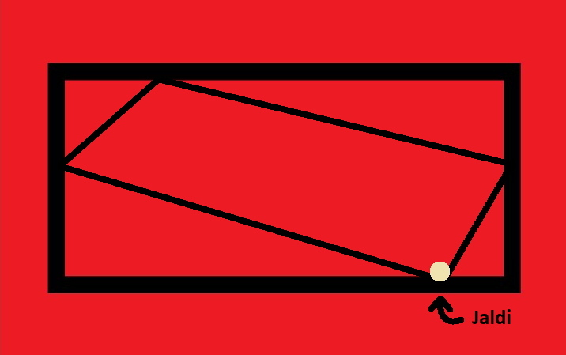

# Soal Praktikum 1
## Daftar Isi
- [Area 51](#area-51)
- [Bakar](#bakar)
- [Find The Pattern](#find-the-pattern)
- [Ganjil Genap](#ganjil-genap)
- [Kampina Ice Cream](#kampina-ice-cream)

## Area 51
| Time Limit | Memory Limit |
|---|:---|
| 1 seconds	| 64 MB |

Mahasiswa TC dikenal dengan mahasiswa yang memiliki logika yang liar. Seringkali mahasiswa TC dapat mengerjakan soal - soal logika yang oleh orang lain dikatakan "gajelas" namun di tangan anak TC berakhir menjadi gampang. Karena hal tersebut, suatu hari Arif diminta tolong oleh temannya dari jurusan lain untuk membantu mengerjakan soal interview kerjanya.

Soal tersebut adalah sebagai berikut:

"Terdapat sebuah deret sebagai berikut:

`1, 4, 5, 16, 17, 20, 21, 64, dst`

Tebaklah bilangan ke N pada deret tersebut"

Arif pun tertarik dengan soal tersebut apalagi temannya menjanjikan sesuatu hal yang Arif inginkan sejak dulu, yaitu Jalan - jalan ke area 51. Arif pun mengiyakan permintaan temannya. Arif pun mulai mengerjakan soal tersebut, dalam waktu 1 hari Arif dapat menemukan pola sebagai berikut.

"Deret tersebut memiliki bentuk lain:

`1, 4, (1+4), 16, (1+16), (4+16), (1+4+16),  dst"`

Namun disaat yang bersamaan, Arif terlalu sibuk untuk melanjutkan mengerjakan hal tersebut. Ia kemudian meminta tolong anda sebagai teman baiknya untuk membuatkan program yang dapat menyelesaikan persoalan tersebut. Bantulah Arif untuk dapat Jalan - jalan ke Area 51.

#### Input Format
Input berupa sebuah bilangan yang menyatakan nilai dari N.

#### Output Format
Output sebuah bilangan N diakhiri dengan enter ("\n").

#### Sample Input
```c
7
```
#### Sample Output
```c
21
```

#### Constraints
1 ≤ N ≤ 4294967296

## Bakar
| Time Limit | Memory Limit |
|---|:---|
| 1 seconds	| 8 MB |



Saat ini di negara Owonesia sedang terjadi permasalahan mengenai RUU KUHP (Rancangan Ulasan-Ulasan Kasih Uang Habis Perkara). Jaldi yang mengikuti perkembangannya, tidak terima dengan adanya perubahan yang menyusahkannya untuk menjadi seorang pengangguran. Agar RUU KUHP itu tidak disahkan, dia pergi mengambil RUU tersebut untuk dia bakar, namun bangunan yang digunakan untuk menyimpan RUU KUHP tersebut memiliki keamanan yang sangat ketat.

Diketahui bentuk bangunannya adalah persegi panjang. Untuk mengambil RUU KUHP-nya, Jaldi perlu melakukan cek pada setiap sisi bangunan. Untuk mengecek setiap sisi bangunan, Jaldi hanya butuh ke 1 titik dari tiap sisinya. Karena waktu untuk mengambil sangat terbatas, maka Jaldi perlu mengelilingi bangunan tersebut dengan efisien. Kamu sebagai orang yang mendukung keinginan Jaldi diminta membantunya mengukur jarak terpendek yang Jaldi butuhkan untuk mengecek keempat sisi bangunan (Jaldi harus kembali ke titik awal). 

#### Input Format
Pada baris pertama input berupa T, yaitu jumlah test casenya. Pada T baris berikutnya, tiap baris berisi P dan L, yang menunjukkan panjang dan lebar dari bangunan tersebut.

```c
T

P L
```

#### Output Format
Output pada tiap test case berupa jarak minimal (bilangan desimal sampai 3 angka dibelakang koma) yang perlu Jaldi tempuh untuk mengecek semua titik pada tiap sisi bangunan sampai dia kembali ke titik awal.

#### Sample Input
```c
3
7 7
3 4
4.5 6
```
#### Sample Output
```c
19.799
10.000
15.000
```
#### Explanation
\-

#### Constraints
1 ≤ T ≤ 10000
1 ≤ P ≤ 1000000000
1 ≤ L ≤ 1000000000

## Find the Pattern
| Time Limit | Memory Limit |
|---|:---|
| 1 seconds	| 8 MB |

Cari pola. Itu aja. Semangat!

#### Input Format
Input baris pertama berupa dua integer A dan B

Input baris kedua berupa integer N

#### Output Format
sesuai input, cek sample case

#### Sample Input 1
```c
1 2
5
```
#### Sample Output 1
```c
^
^^^
^^^^^
^^^^^^^
^^^^^^^^^
```
#### Sample Input 2
```c
5 3
3
```
#### Sample Output 2
```c
^^^^^
^^^^^^^^
^^^^^^^^^^^
```
#### Explanation
cari sendiri patternnya :)

#### Constraints
1 ≤ A,B ≤ 10
1 ≤ N ≤ 100

## Ganjil Genap
| Time Limit | Memory Limit |
|---|:---|
| 1 seconds	| 8 MB |

Karena maraknya ganjil genap di Jakarta, maka Budi yang gabut berusaha mencari tau manakah bilangan yang lebih besar diantara ganjil dan genap.

#### Input Format
Baris pertama berisi angka T dimana T adalah banyaknya angka yang akan dimasukkan di baris berikutnya. Baris berikutnya berisi inputan bilangan N.

#### Output Format
Ketika bilangan genap, maka dijumlahkan. Jika ganjil, maka dikurangi.

#### Sample Input
```c
5
1 2 3 4 5
```

```c
4
5 2 6 1
```
#### Sample Output
```c
-3
```
```c
2
```
#### Explanation
Test case pertama :

`(2+4)+(-1-3-5) = -3`

Test case kedua :

`(2+6)+(-1-5) = 2`

#### Constraints
1 ≤ T ≤ 20
1 ≤ N ≤ 2^63

## Kampina Ice Cream
| Time Limit | Memory Limit |
|---|:---|
| 1 seconds	| 8 MB |

Pada saat liburan musim panas, perusahaan Es Krim Kampina mengadakan promosi Es Krim besar-besaran dengan mengedarkan Es Krim dengan 2 pesawat Jet (Jet A dan Jet B) ke wilayah tertentu.

Karena rencana promosi dilakukan secara dadakan dan manager Kampina yang bekerja dengan sembrono, manager lupa memesan bahan bakar untuk pesawat Jet mereka sehingga mengharuskan untuk memesan bahan bakar secara bertahap.

Jet A dan Jet B akan ditugaskan untuk mengedarkan ke wilayah yang jaraknya tidak mencapai X km.

Untuk Jet A, bahan bakar hanya cukup untuk mengedarkan a km lebih jauh daripada hari sebelumnya,

Sedangkan untuk Jet B, bahan bakar hanya cukup untuk mengedarkan b km lebih jauh daripada hari sebelumnya.

Apabila jarak pengedaran Es Krim oleh Jet A dan Jet B sama, demi menghemat bahan bakar, hanyalah salah satu pesawat yang berangkat pada hari yang ditentukan. 

Manager Kampina yang lalai ini meminta bantuan kalian sebagai Programmer untuk menghitung jarak tempuh total dari pesawat Jet A dan Jet B sehingga Manager Kampina dapat memprediksi cost yang dibutuhkan pada saat promosi dilakukan.

#### Input Format
Terdapat 1 baris input yang terdiri dari 3 integer (a, b, X)

`a b X`

#### Output Format
Print jarak tempuh total dari pesawat Jet A dan Jet B

#### Sample Input
```c
3 5 11
5 10 16
```
#### Sample Output
```c
33
30
```

#### Explanation
##### Input Pertama

Batas tempuh Jet A dan Jet B adalah 11 km

Jarak tempuh Jet A per harinya,

Hari ke - 1 : 3 km

Hari ke - 2 : 6 km

Hari ke - 3 : 9 km (dan berhenti karena tidak boleh mencapai 11 km)

Total A -> 3 + 6 + 9 = 18 km

Jarak tempuh Jet B per harinya,

Hari ke - 1 : 5 km

Hari ke - 2 : 10 km (dan berhenti karena tidak boleh mencapai 11 km)

Total B -> 5 + 10 = 15 km

Total akhir -> Total A + Total B = 33 km

 

##### Input Kedua

Batas tempuh : 16 km

Jarak tempuh Jet A per harinya,

Hari ke - 1 : 5 km

Hari ke - 2 : 10 km (Jet A memberi kesempatan pada Jet B mengedarkan Es Krim untuk menghemat bahan bakar)

Hari ke - 3 : 15 km (dan berhenti karena tidak boleh mencapai 16 km)

Total A -> 5 + 15 = 20 km

Jarak tempuh Jet B per harinya,

Hari ke - 1 : 10 km (dan berhenti karena tidak boleh mencapai 16 km)

Total B -> 10 km

Total akhir -> Total A + Total B = 30 km

#### Constraints
1 ≤ X ≤ 10000
1 ≤ a,b ≤ X
