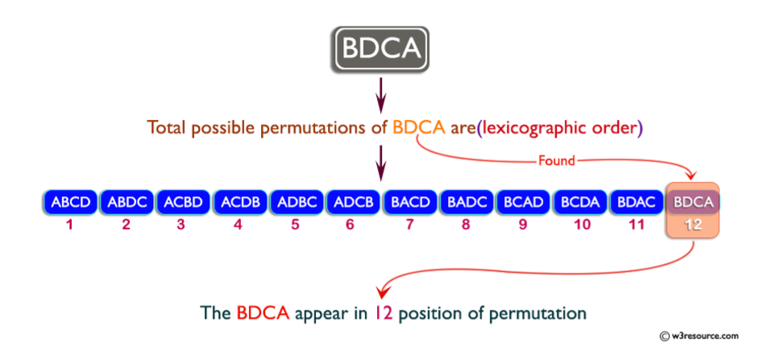

# Soal Praktikum 3 Kelas D
## Daftar Isi
- [Boker - BK](#boker)
- [Jason Sang Desainer - JSD](#jason-sang-desainer)
- [Kebakaran Hutan - KH](#kebakaran-hutan)
- [Kampina Kode Seri - KKS](#kampina-kode-seri)

## Boker
| Time Limit | Memory Limit |
|---|---|
| 1 seconds | 64 MB |

Selamat anda telah membantu Arif menghitung hutang - hutang yang dimiliki komplek lesu. Sebagai imbalannya Arif mengajak anda untuk berjalan - jalan ke Area51. Setibanya di Area51, Arif ditantang oleh seorang/sebuah/seekor(gatau yg mana bener) alien untuk menyelesaikan wahana labirin. 

Labirin tersebut berukuran N x M dengan spesifikasi sebagai berikut: 
* Hanya bisa dimasuki Oleh 1 orang pemain. 
* Terdapat 1 buah 'S' yang merupakan tempat pemain memu ai petualangan. 
* Terdapat 1 buah 'F' yang merupakan tempat pemain mengakhiri petualangan. 
* Karakter '.' merupakan jalan pada abirin yang dapat dilewati. 
* Karakter '#' merupakan tembok pada labirin yang tidak dapat dilewati, 
* Tidak ada toilet pada labirin 

Arif pun menerima tantangan tersebut. Namun apesnya, Saat Arif memasuki labirin ia disihir deh alien agar mendadak ingin boker. Hal tersebut menyebabkan Arif tidak mampu berpikir secara logis dan ingin segera keluar dari labirin tersebut. Melihat Arif panik dan alien tertawa anda segera membantu Arif untuk menyelesaikan labirinnya. Diberikan ukuran dan peta labirin, bantulah Arif untuk keluar dari labirin beserta langkah langkahnya. 

Perlu diperhatikan Arif hanya dapat bergerak dalam langkah - langkah sebagai berikut 
1. 'T' jalan 1 ke arah atas.
2. 'L' jalan 1 ke arah kiri. 
3. 'B' jalan 1 ke arah bawah. 
4. 'R' jalan 1 ke arah kanan. 
Apabila terdapat jalur dengan langkah terpendek yang sama, maka cetak langkah - langkah dengan prioritas angkah sesuai urutan diatas (T didahulukan daripada L). 

Contoh: 

T B R dengan L L L 

maka cetak T B R. 

#### Input Format 
Sebuah baris berisi 2 buah bilangan N, M.

Baris selanjutnya berisi peta labirin tempat Arif terjebak. 

#### Output Format 
Apabila terdapat jalur untuk mengakhiri petualangan 

Baris pertama berisi sebuah bilangan yang menyatakan jumlah langkah minimal untuk mencapai tujuan. 

Baris kedua berisi langkah - langkah yang harus dijalani oleh Arif untuk mencapai tujuan sesuai dengan penjelasan diatas. 

Apabila tidak ada maka keluarkan string "Tidak ada jalan menuju F." 

#### Sample Input 
```c
4 4 
#.S# 
...# 
#.#. 
#..F 
```

#### Sample Output 
```c
Langkah minimum: 6 
L B B B R R 
```
#### Constraints 
1 ≤ N, M ≤ 100 

## Jason Sang Desainer
| Time Limit | Memory Limit |
|---|---|
| 1 seconds | 8 MB |

Jason seorang mahasiswa fakultas desain sangat senang dengan pola. Namun dia mulai bosan dengan pola-pola desain dan dia mencoba mempelajari pola matematika. Ia mengetahui kalau suku pertama dan kedua pada pola ini merupakan 1. Sedangkan bilangan pada suku ke 3,4,5 dan 6 adalah 4,16,128 dan 4096. Bantu Jason menentukan bilangan pada suku berikutnya. 

#### Input Format 
Baris pertama berisi T dimana T adalah total Testcase. 

Baris berikutnya berisi x yang mana berisi suku ke-x pada suatu pola. 

#### Output Format
Output merupakan nilai pada suku ke-x. 

#### Sample Input
```c
3 3
4
5 
```

#### Sample Output
```c
4
16
128 
```

#### Constraints 
1 ≤ T ≤ 20 \
1 ≤ x ≤ 9

## Kebakaran Hutan
| Time Limit | Memory Limit |
|---|---|
| 1 seconds | 8 MB |

Dalam sebuah hutan, terjadi kebakaran. Semua pohon-pohon (direpresentasikan oleh '.') di hutan tebakar tanpa terkecuali. Lebih parahnya lagi, ternyata hutan ini dimiliki beberapa orang, namun kalian tidak tahu berapa, yang kalian tahu hanyalah ada pagar-pagar(direpresentasikan oleh '#') yang menandakan jika area yang dikelilingi pagar itu dimiliki seseorang. Setiap lahan di hutan milik seseorang, tidak ada yang tidak bertuan. 

#### Input Format 
Peta berukuran 10x10 

#### Output Format
Jumlah orang yang lahannya di hutan terbakar 
#### Sample Input
```c
..#....#.# 
..#.....#. 
..#....... 
..######## 
.......... 
.......... 
....###### 
....#..... 
....#..... 
....#..... 
```

#### Sample Output
```c
4 
```

#### Explanation 
Hitung aja areanya

## Kampina Kode Seri
| Time Limit | Memory Limit |
|---|---|
| 1 seconds | 8 MB |

Pada minggu ini, Manager Kampina telah berhasil mengeksekusi rencana keberangkatan tiap pesawat ke daerah promosinya masing – masing berkat bantuan kalian para Programmer, namun sangat disayangkan bahwa saat dilakukannya eksekusi rencana, yang tidak diharapkan terjadi. 

Beberapa pesawat yang telah berangkat tiba – tiba hilang dari deteksi menara pengawas dan membuat Manager Kampina khawatir, untungnya, saat diproduksinya pesawat Jet, **tiap pesawat Jet memiliki kode seri unik** yang membedakan pesawat satu dengan pesawat lainnya, sehingga Manager dapat melakukan pengecekan kode seri pesawat manakah yang hilang dari radar.
 
Perusahaan yang memproduksi pesawat Jet ini mencantumkan **kode seri untuk tiap pesawat Jet berupa lexicographic permutation (tidak case-sensitive)**. *)Contoh Lexicographic Permutation dapat dilihat pada gambar



Untuk mempermudah pencarian pesawat Jet yang hilang dan tidak mengganggu rencana promosi awal, Manager ingin memerintahkan pesawat Jet yang belum berangkat untuk mencari dan menggantikan pesawat Jet yang hilang ke daerah promosi, namun disayangkan bahwa Manager tidak mengetahui kode seri pesawat apa yang harus menggantikan pesawat yang hilang.
 
Dimisalkan **Pesawat Awal PA**, dan **Pesawat yang Hilang PH**, Apabila jadwal keberangkatan pesawat Jet adalah berurutan, bantu Manager menemukan kode seri **Pesawat Pencari PP** yang dapat mencari dan menggantikan **Pesawat yang Hilang PH** dengan jadwal keberangkatan **urutan ke X setelah Pesawat yang Hilang PH berangkat**. 

#### Input Format 
Terdapat 1 baris input yang terdiri dari 2 string dan 1 integer (PA, PH, X) 
```c
PA PH X
```
 
#### Output Format 
Print kode seri Pesawat Pencari PP 
```c
PP
```
 
#### Sample Input
```c
AEX EAX 2
AdsZ dsZA 3
```
 
#### Sample Output
```c
XAE 
sAdZ
```

#### Explanation
##### Input Pertama 
Dengan kode seri **Pesawat Awal “AEX”** dengan **Pesawat yang Hilang “EAX”** didapatkan jadwal keberangkatan sebagai berikut : 

**AEX (PA)** -> AXE -> **EAX (PH)** -> EXA -> **XAE (Urutan ke – 2 setelah PH)** -> XEA 

Sehingga didapatkan **kode seri Pesawat Pencari** adalah **XAE**
 
##### Input Kedua 
Dengan kode seri **Pesawat Awal “AdsZ”** dengan **Pesawat yang Hilang “dsZA”** didapatkan jadwal keberangkatan sebagai berikut : 

**AdsZ (PA)** -> AdZs -> AsdZ -> AsZd -> AZds -> AZsd -> dAsZ -> dAZs -> dsAZ -> **dsZA (PH)** -> dZAs -> dZsA -> **sAdZ (Urutan ke – 3 setelah PH)** -> sAZd -> sdAZ -> sdZA -> sZAd -> sZdA -> ZAds -> ZAsd -> ZdAs -> ZdsA -> ZsAd -> ZsdA
 
Sehingga didapatkan **kode seri Pesawat Pencari** adalah **sAdZ** 

#### Constraints 
2 ≤ len(PA), len(PH) ≤ 10 \
1 < X < 4.000.000
