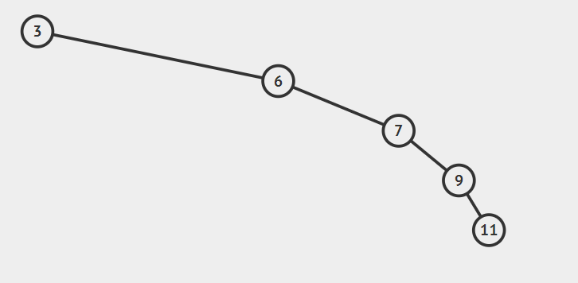
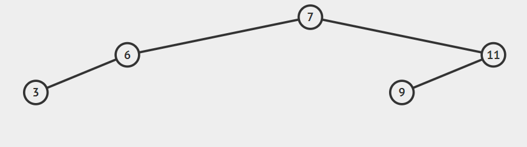

# Soal Praktikum 2 Kelas A
## Daftar isi
- [Keluarga Cemara - KC](#keluarga-cemara)
- [Kotak Wowong - KW](#kotak-wowong)
- [Thanos Belum Komplit - TBK](#thanos-belum-komplit)
- [Ula Males Bikin Soal - UMBS](#ula-males-bikin-soal)

## Keluarga Cemara
| Time Limit | Memory Limit |
|---|---|
| 1 seconds | 4 MB |

Cetak semua relasi langsung yang dimiliki sebuah node pada tree. Jika node tersebut merupakan node root, anggap parentnya bernilai -1. Jika di dalam tree tidak terdapat node tersebut, cetak "404 Not Found"

#### Input Format
Baris pertama merupakan N (banyak bilangan di dalam tree)

Baris kedua berisi nilai node-node pada tree sebanyak N

Baris ketiga berisi M (banyak node yang ingin dicari relasinya)

M-baris selanjutnya merupakan nilai node yang ingin dicari relasinya

#### Output Format
M baris, di mana masing-masing baris berisi parent dan child node tersebut

#### Sample Input
```c
10
10 6 19 2 7 22 16 20 13 9
3
10
6
13
```

#### Sample Output
```c
-1 6 19
10 2 7
16
```

#### Sample Input
```c
5
8 2 10 5 7
3
5
11
8
```

#### Sample Output
```c
2 7
404 Not Found
-1 2 10
```
#### Constraints
* 1 ≤ N, M ≤ 100

## Kotak Wowong
| Time Limit | Memory Limit |
|---|---|
| 0.5 seconds | 4 MB |

Wowong mempunyai kotak kosong yang akan dia manfaatkan untuk menyimpan angka-angka yang dia punya.Karena Wowong mudah bosan, Wowong bisa membuang angka yang tidak dia sukai kapanpun dia mau. Meskipun Wowong mudah bosan, tapi dia punya hobi lain yaitu mengurutkan angka-angka tersebut dan mencari angka apa yang ada di urutan ke X. Kalian sebagai teman Wowong yang jago ngoding, bantulah Wowong untuk membuat program sesuai kebiasaan Wowong.  

#### Input Format
1 X -> Insert X

2 X -> Delete X

3 X -> Mencari angka yang ada di urutan ke X

-1 -> Exit 

#### Output Format
Jika Input 3 X. Outputnya adalah angka yang ada di urutan ke X.

Jika data yang dicari tidak ada. Outputnya adalah -1

#### Sample Input
```c
1 20
1 30
1 5
2 5
3 1
-1
```
#### Sample Output
```c
20
```

## Thanos Belum Komplit
| Time Limit | Memory Limit |
|---|---|
| 0.4 seconds | 128 MB |

Showclip evenjer engem sudah keluar!!! Thanus ketakutan karena ia akan menghadapi para superhero yang akan menyerangnya sendirian!! Jadi ia memanggil teman lamanya, Yong. Yong adalah salah satu teman baik Thanus. Yong berbohong kepada Thanus bahwa ia akan membantu Thanus mengalahkan evenjer, padahal Yong sendiri hanya ingin melihat Thanus dipukul habis-habisan oleh evenjer. Namun Yong sekarang sedang berada di galaksi lain. Setiap galaksi memiliki k jarak, sebagai penanda jarak yang harus ditempuh dari satu galaksi sebelumnya ke galaksi tersebut. Karena ia harus pergi ke galaksi dimana Thanus berada, maka ia mencari tahu apakah ada jalan ke Galaksi tersebut dengan N jaraknya. Setiap galaksi hanya mempunyai 2 jalan ke galaksi lain, dimana yang satu selalu lebih pendek dari jarak satunya, dan galaksi dengan jarak pendek selalu berkumpul dengan galaksi lain yang jaraknya pendek. Namun banyak galaksi yang harus ditempuh dari galaksi satu ke galaksi lain selalu sama atau maksimal hanya selisih satu. Bantu Yong mencari tahu apakah ada jalan dengan jarak N yang pas agar dia tidak datang terlambat ataupun duluan. Dengan syarat jarak galaksi yang ditempuh tidak boleh backtrack

#### Input Format
Input diawali dengan N banyak testcase

Setiap testcase bisa mengquery 1 atau 2

Setiap query diikuti oleh bilangan k,

1 k berarti Yong mendapatkan galaksi lain yang harus ia tempuh sejauh k, dengan galaksi yang memiliki jarak yang sama akan dianggap tidak ada

2 k berarti Yong mencari tahu apakah ada jarak sebesar k dari satu galaksi ke galaksi lain, dengan syarat galaksi tersebut hanya menggunakan satu jalan saja

#### Output Format
setiap query 2, print

"Yong" apabila ada jalan sejauh k

"Tidak Yong" apabila tidak ada jalan yang bisa ia lewati

Diikuti dengan endline 

#### Sample Input
```c
8
1 2
2 1
1 1
2 1
1 3
2 3
2 5
2 6
```

#### Sample Output
```c
Tidak Yong
Yong
Yong
Yong
Tidak Yong
```

#### Explanation
Untuk 2 1, karena tidak ada galaksi berjarak 1, maka Yong tidak menemukan jalan
Untuk 2 5, karena ada jalan sejauh 5, dari galaksi dengan k=2 lalu ke galaksi dengan k=3
```c
  2
 /   \
1   3
```
k = 2 -> k = 3
Untuk 2 6, karena ada jalan sejauh 6, namun ia menempuh k=1, k=2, k=3, maka kombinasi jalan nya sebagai berikut
```c
  2
 /   \
1   3
```
k = 2 -> k = 1 -> k = 2 -> k = 3
Karena jalur galaksi 2 dilewati dua kali (backtrack), maka Yong tidak bisa menemukan jalan
#### Constraints
* 1 < N < 10000
* 0 < k < 1000000

## Ula Males Bikin Soal
| Time Limit | Memory Limit |
|---|---|
| 0.1 seconds | 10 MB |

Karena Ula lagi males bikin cerita jadi langsung saja pada problem. Pada problem ini kalian diminta untuk membuat sebuah Binary Search Tree yang balance atau seimbang sesuai dengan pola pada testcase. Binary Search Tree yang imbang adalah Tree dimana perbedaan tinggi node(height) sebelah kanan dengan node sebelah kiri atau disebut balance factor bernilai kurang dari sama dengan 1.

Cara menentukan Height :
- Jika node (root) tidak memiliki subtree heightnya = 0
- Jika node adalah leaf, height =  1
- Jika internal node, maka height =  height tertinggi dari anak + 1

Balance Factor didapat dari selisih height dari node kiri dan kanan

Untuk height dan balance factor secara lebih lengkap akan dijelaskan pada modul selanjutnya. Pada soal ini kalian tidak perlu menghtung height atau mengecek apakah tree tersebut sudah balance tapi cukup menemukan pola insertion pada BST sehingga untuk segala jenis inputan terbentuk BST yang balance sesuai deskripsi.

Gunakanlah BST dan Struktur Data yang sebelumnya telah dipelajari.

#### Input Format
Diberikan inputan berupa testcase t. Baris berikutnya n integer unik sebanyak t.

#### Output Format
Untuk setiap testcasenya keluarkan hasil cetak secara preorder,inorder dan postOrder, sesuai ketentuan. Setiap angka selalu diikuti pola.

#### Sample Input 1
```c
10
1 2 3 4 5 6 7 8 9 10
```

#### Sample Output 1
```c
6 3 2 1 5 4 9 8 7 10
1 2 3 4 5 6 7 8 9 10
1 2 4 5 3 7 8 10 9 6
```

#### Sample Input 2
```c
5
3 6 7 9 11
```

#### Sample Output 2
```c
7 6 3 11 9
3 6 7 9 11
3 6 9 11 7 
```

#### Explanation
Pada Testcase 2 jika BST dibangun menggunakan insertion sesuai urutan input maka akan terbentuk BST seperti berikut



Didapat hasil Skewed BST,.

Nah karena yang diminta tree balance maka kita melakukan modifikasi pada urutan penginputan agar bisa memastikan semua testcase menghasilkan tree yang balance. Dengan cara membangun BST dari nilai tengah dari suatu set angka dan membagi set tersebut menjadi set yang lebih kecil. Sehingga pada testcase

3 6 7 9 11

7 akan dimasukan pertama

Kemudian dari set sebelah kiri 3,6 midpointya adalah 6

Kemudian 3 dimasukan

Kemudian dari set kanan yaitu 9,11 dicari midpointnya yaitu 11

Terakhir 9 dimasukan.

sehingga didapat tree seperrti berikut.

 

Yang perlu diingat bentuk sebuah BST ditentukan oleh urutan memasukan data yang bisa dilihat pada hasil PreOrder printing.

#### Constraints
* 1 ≤ t ≤ 1000000
* 1 ≤ n ≤ 1000000
