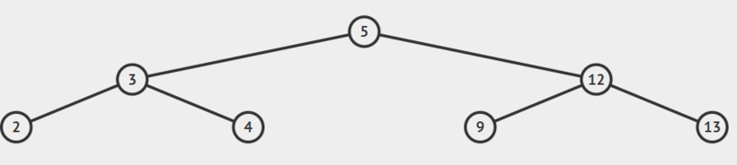
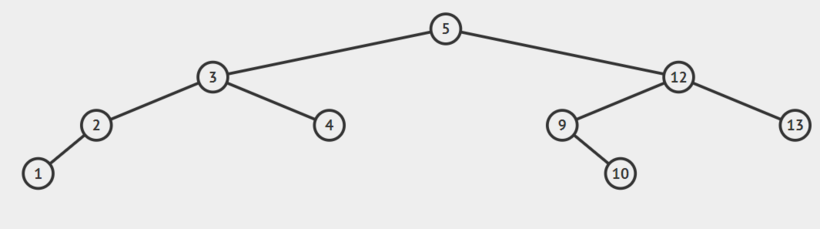
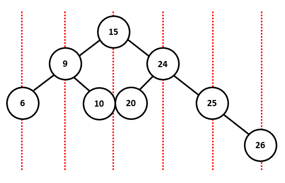

# Soal Praktikum 3 Kelas A
## Daftar Isi
- [EzAcAvl](#ezacavl)
- [Tugas Kelas](#tugas-kelas)
- [Mantap](#mantap)
- [Slow and Curious](#slow-and-curious)

## EzAcAvl
| Time Limit | Memory Limit |
|---|---|
| 1 seconds | 64 MB |

Pada problem ini agar bisa AC kalian diberikan 3 buah query
1.	Diberikan integer x, masukan x pada pohon AVL.
2.	Diberikan integer x, temukan index x pada hasil inorder transversal AVL.
3.	Diberikan integer x, temukan jumlah semua node pada subtree x (tree dengan root x).

Gunakan AVL untuk menyelesaikan program ini.

Notes: Tidak dijamin bahwa x akan selalu berbeda. Jika x sudah ada pada tree maka tidak perlu dimasukan lagi.

#### Input Format
Baris pertama berupa integer t dimana t adalah jumlah query yang harus dieksekusi.

t baris berikutnya adalah query dengan format berikut ini

1 x berarti masukan integer x pada AVL

2 x berarti temukan index x pada inorder transversal AVL.

3 x berarti jumlahkan x dengan semua node pada subtree dengan root x.

#### Constraints
* 1 <= t < 2^31 - 1
* 0 <= x < 2^31 - 1

#### Output Format
Untuk Query tipe 1 tidak perlu output.

Untuk Query tipe 2 dan tipe 3 cetak integer yang merupakan jawaban atau cetak "Data Tidak Ada" jika x tidak ada pada pohon AVL.

#### Sample Input 0
```c
20
1 5
1 3
1 12
1 2
1 4
1 13
1 9
2 1
2 5
2 13
2 9
1 1
1 10
2 1
3 1
3 4
3 1
3 10
3 99
3 5
```

#### Sample Output 0
```c
Data tidak ada
4
7
5
1
1
4
1
10
Data tidak ada
59
```

#### Explanation 0
Ketika query 2 5 dijalankan pohon avl berada pada kondisi seperti ini.



Sehingga ketika dilakukan inorder traversal hasilnya adalah 2,3,4,5,9,12,13. Sehingga ketika ditanya index dari angka 5 maka jawabanya adalah 4(index dimulai dari 1) Kemudian ketika query 3 1 dipanggil kondisi pohon AVL adalah sebagai berikut



Karena node 1 berada pada posisi leaf maka hasilnya adalah nilai node itu sendiri yaitu 1. Ketika Query 3 5 dipanggil maka akan dilakukan penjumlahan semua node yang ada dalam tree dengan root 5 yaitu 1+2+3+4+5+9+10+12+13 = 59. Semisal yang diminta adalah 3 9 maka hasilnya adalah penjumlahan dari semua node pada tree dengan root 9 yaitu 9+10 = 19.

#### Sample Input 1
```c
10
1 100
1 74
2 100
2 70
1 152
1 21
1 33
2 100
2 21
2 1
```

#### Sample Output 1
```c
2
Data tidak ada
4
1
Data tidak ada
```

## Tugas Kelas
| Time Limit | Memory Limit |
|---|---|
| 1 seconds | 64 MB |

Suatu hari mahasiswa Struktur Data A diberi tugas untuk membuat AVL Tree. Data di Tree tersebut sangat banyak. Pembuatan Tree adalah dengan mengetikkan perintah insert x, di mana x adalah nilai yang ingin dimasukkan ke Tree.

Setelah penugasan itu berakhir, para mahasiswa diberi tugas follow-up, yaitu untuk mencari jumlah nilai node per kolom dari data paling kiri hingga paling kanan. Jumlah nilai per kolom dicetak dengan mengetikkan perintah print.

Pembagian kolom untuk Sample Input 0 divisualisasikan seperti di bawah ini:



#### Input Format
Baris pertama adalah **N**. **N**-baris selanjutnya terdiri dari **A** (perintah insert atau print). Jika perintah adalah insert, maka lanjutkan input dengan memasukkan **X** (nilai node).

#### Constraints
* 1 < N < 10000
* 1 < X < 10000

#### Output Format
Output hanya jika perintah di input adalah "print". Tampilkan jumlah nilai node per kolom.

#### Sample Input 0
```c
9
insert 20
insert 10
insert 15
insert 9
insert 6
insert 25
insert 24
insert 26
print
```

#### Sample Output 0
```c
6 9 45 24 25 26 
```

#### Sample Input 1
```c
11
insert 19
insert 14
insert 39
insert 11
print
insert 24
insert 36
insert 31
insert 21
insert 38
print
```

#### Sample Output 1
```c
11 14 19 39 
11 35 43 105 39 
```

## Mantap
| Time Limit | Memory Limit |
|---|---|
| 1 seconds | 64 MB |

Pada problem ini, tugas kalian yang utama adalah mencetak setiap leaf node yang terdapat pada tree

#### Input Format
Baris pertama berisi sebuah integer N testcase. N baris berikutnya berisi angka merepresentasikan pilihan eksekusi program diikuti dengan sebuah nilai X, dengan detail berikut:
* 1 X = Insert X ke dalam tree
* 2 X = Remove X yang ada di dalam tree
* 3 = Cetak node yang merupakan leaf yang ada di dalam Tree.

#### Constraints
* 1 < N < 10000
* 1 < X < 10000

#### Output Format
Output hanya jika mengeksekusi pilihan 3. Tampilkan leaf node yang ada pada tree.

#### Sample Input 0
```c
6
1 1
1 2
1 3
3
2 2
3
```

#### Sample Output 0
```c
1 3 
1 
```

#### Sample Input 1
```c
8
1 1
1 3
1 2
3
1 5
1 10
2 2
3
```

#### Sample Output 1
```c
1 3 
1 10  
```

## Slow and Curious
| Time Limit | Memory Limit |
|---|---|
| 1 seconds | 64 MB |

Van Daesel geram karena filmnya Slow and Curious bisa saja tidak jadi tampil. Dia menghubungi temannya Han yang baru saja comeback dari kematian untuk memburu Copid-20. Copid-20 adalah anak dari Sers-04 dan Mars-14. Van Daesel dan Han sekarang sedang berada di kota yang tidak ada Copid-20. Setiap kota memiliki k jarak, sebagai penanda jarak yang harus ditempuh dari satu kota ke kota lainnya. Karena Van Daesel dan Han harus pergi ke kota dimana Copid-20 berada, mereka harus mencari tahu apakah ada jalan ke kota tersebut dengan N jaraknya. Setiap kota hanya mempunyai 2 jalan ke kota lain, dimana yang satu selalu lebih pendek dari jarak satunya dan kota dengan jarak pendek selalu berkumpul dengan kota lain yang jaraknya pendek. Namun banyaknya kota yang harus ditempuh dari kota satu ke kota lainnya selalu sama atau maksimal hanya selisih satu. Bantu Van Daesel dan Han mencari tahu apakah ada jalan dengan jarak N yang pas agar dia tidak datang terlambat ataupun duluan. Dengan syarat jarak kota yang ditempuh tidak boleh backtrack.

#### Input Format
Input diawali dengan N banyak testcase

Setiap testcase bisa mengquery 1 atau 2 Setiap query diikuti oleh bilangan k,

1 k berarti Van Daesel dan Han mendapatkan kota lain yang harus ia tempuh sejauh k, dengan kota yang memiliki jarak yang sama akan dianggap tidak ada

2 k berarti Van Daesel dan Han mencari tahu apakah ada jarak sebesar k dari satu kota ke kota lain, dengan syarat kota tersebut hanya menggunakan satu jalan saja

#### Output Format
setiap query 2, print

"Basmi Copid-20" apabila ada jalan sejauh k

"Tunggu saja Copid, kau akan kami basmi" apabila tidak ada jalan yang bisa ia lewati

Diikuti dengan endline

#### Input Format
```c
8
1 2
2 1
1 1
2 1
1 3
2 3
2 5
2 6
```

#### Constraints
* 1 < N < 10000
* 0 < k < 1000000

#### Output Format
```c
Tunggu saja Copid, kau akan kami basmi 
Basmi Copid-20
Basmi Copid-20
Basmi Copid-20
Tunggu saja Copid, kau akan kami basmi
```

#### Explanation
Untuk 2 1, karena tidak ada kota berjarak 1, maka Van Daesel dan Han tidak menemukan jalan

Untuk 2 5, karena ada jalan sejauh 5, dari kota dengan k=2 lalu ke kota dengan k=3
```c
   2   
 /   \
1     3
```

k = 2 -> k = 3

Untuk 2 6, karena ada jalan sejauh 6, namun ia menempuh k=1, k=2, k=3, maka kombinasi jalan nya sebagai berikut
```c
   2
 /   \
1     3
```

k = 2 -> k = 1 -> k = 2 -> k = 3

Karena jalur kota 2 dilewati dua kali (backtrack), maka Van Daesel dan Han tidak bisa menemukan jalan
