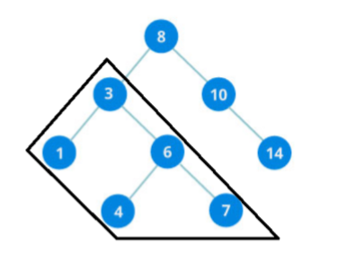
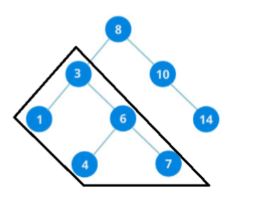

# Soal Praktikum 2 Kelas B
## Daftar Isi
- [KOYER2 - KOYER2](#koyer2)
- [Leafsum - LS](#leafsum)
- [SubTree - ST](#subtree)
- [Tinggal Copas Aja II - TCAII](#tinggal-copas-aja-II)

## KOYER2
| Time Limit | Memory Limit |
|---|---|
| 1 seconds | 8 MB |

Jimjemz adalah pecinta literasi karena dia gila. Jimjemz mempunyai koleksi buku dari berbagai tahun. Karena koleksi buku Jimjemz banyak banget, maka kamu diminta tolong oleh Jimjemz untuk menyusun buku-bukunya dari rak buku paling kiri ke kanan sesuai urutan tahun terbitnya dari yang terkecil hingga terbesar. Karena kesusahan yang dialami oleh Jimjemz hingga berkata "aww susah bgtt,,". Mending kalian kerjain soal lain dulu aja, sayang dua jam waktunya terbuang sia-sia buat baca deskripsi soal ini - Jimjemz dkk 

#### Input Format 
baris pertama integer T sebagai testcase 

baris kedua integer N sebagai pilihan proses dan M sebagai tahun terbit 

untuk N = 1 maka menyimpan buku 

untuk N = 2 maka mencari posisi buku

#### Output Format 
menampilkan posisi buku 

jika tidak ada maka outputnya adalah "Buku tidak ada" 

#### Sample Input
```c
5 
1 2 
2 4 
1 4 
2 2 
2 4 
```

#### Sample Output
```c
Buku tidak ada 
1 
2
```

#### Sample Input
```c
5 
1 2 
1 2 
1 2 
1 2 
2 2
```

#### Sample Output
```c
4 
```

#### Explanation 
untuk sample kedua, karena memiliki tahun yang sama maka hasil outputnya adalah posisi buku yang paling kanan 

#### Constraints 
1 ≤ T ≤ 5080 \
1 ≤ N ≤ 2 \
1 ≤ B ≤ 1000000000

## Leafsum
| Time Limit | Memory Limit |
|---|---|
| 1 seconds | 10 MB |

mencari jumlah semua leaf node dari BST 

#### Input Format 
baris pertama berisi jumlah input 

baris berikut berisi n integer sebagai node BST 

#### Output Format 
sebuah integer jumlah nilai semua leaf 

#### Sample Input
```c
3 
1 2 3
```

#### Sample Output
```c
3
```

#### Explanation 
```c
tree 
1
   \
      2
         \
           3
```
 
#### Sample Input
```c
3 
2 1 3
```

#### Sample Output
```c
4 
```

#### Explanation 
```c
tree 
     2
   /   \
 1        3 
```

#### Constraints 
1 ≤ n ≤ 100000 \
1 ≤ val ≤ 1000000

## SubTree
| Time Limit | Memory Limit |
|---|---|
| 1 seconds | 256 MB |

Pada problem ini kalian dimintai tolong untuk menghitung subTree yang menghubungkan bilangan L dan R yang terdapat di dalam sebuah binary tree. 

#### Input Format 
Baris pertama berisi dua buah integer N dan Q. 

Baris kedua berisi N integer A yang dipisahkan dengan spasi. 

Baris berikutnya hingga baris ke Q+2 berisi dua buah integer L dan R. 

#### Output Format 
Untuk setiap query outputkan hasil penjumlahan sub-Tree yang menghubungkan bilangan L dan R. Jika bilangan tidak terdapat dalam binary tree outputkan -1. 

#### Sample Input
```c
8 3 
8 3 10 1 6 14 4 7 
1 4 
3 7 
4 9 
```

#### Sample Output
```c
21 
21 
-1 
```

#### Explanation 
Query - 1



Query - 2



#### Constraints 
1 ≤ N ≤ 1000 \
1 ≤ Q ≤ 1000 \
1 ≤ A ≤ 1000 \
1 ≤ L ≤ 1000 \
1 ≤ R ≤ 1000

## Tinggal Copas Aja II
| Time Limit | Memory Limit |
|---|---|
| 1 seconds | 64 MB |

Phan saat ini sedang belajar tentang Binary Search Tree. Lalu ia menemukan artikel tentang metode traversal pada sebuah BST yaitu PreOrder Traversal,PostOrder Traversal dan InOrder Traversal. Karena penasaran, ia pun mencoba membuat program untuk mengetahui urutan ke-x untuk suatu traversal.
 
Tapi, karena ia belum lancer ngoding, ia selalu gagal untuk menghasilkan output yang diinginkan. Bantulah Phan untuk membuat program tersebut 

#### Format Masukan 
Baris pertama berisi sebuah bilangan Q yang merupakan banyaknya query 

Q baris selanjutnya berisi salah satu dari 2 tipe query yaitu : 

“1 K” yang berarti bilangan K dimasukkan kedalam BST

“2 s X” yang berarti program harus mencetak bilangan pada urutan ke X dalam traversal s. Dijamin ukuran tree pada saat itu <= X

#### Format Keluaran 
Untuk setiap query dengan tipe 2, keluarkan sebuah bilangan sesuai dengan deskripsi soal. 

#### Contoh Input 
```c
6 
1 2 
1 1 
1 3 
2 inorder 2 
2 preorder 3 
2 postorder 1 
```

#### Contoh Output
```c
2 
3 
1 
```

#### Constraints 
1 ≤ Q ≤ 1000 \
1 ≤ K ≤ 10^5
