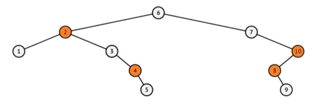
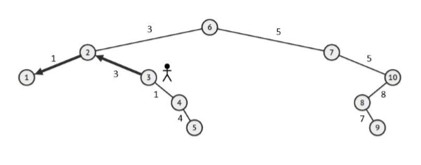

# Soal Praktikum 2 Kelas E
## Daftar Isi
- [A to B - AB](#a-to-b)
- [Ants Colony - ANCOL](#ants-colony)
- [Baney-ry Search Tree - BST1](#baney-ry-search-tree)
- [Baney-ry Search Tree 2 - BST2](#baney-ry-search-tree-2)
- [Habisin Duit - HADU](#habisin-duit)

## A to B
| Time Limit | Memory Limit |
|---|---|
| 0.1 seconds | 10 MB |

Pisi sudah belajar tentang Binary Search Tree. Saat ini, ia merasa mampu untuk mengerjakan semua problem yang berkaitan dengan BST. Karena Pisi merasa sudah jago, ia ditantang untuk mengerjakan suatu problem. Diberikan barisan angka dari a hingga b (inklusif). Ia diminta untuk memasukkannya ke dalam BST. Karena terlalu gampang, maka ia diberikan beberapa command. 
* Command "1 x" digunakan untuk menghapus bilangan x dari tree tersebut. 
* Command "2 x" digunakan untuk menampilkan index bilangan x secara inorder. 

Karena menurut Pisi soal tersebut terlalu gampang, ia malas dan malah memberimu soal tersebut untuk dikerjakan. Buktikan bahwa soal tersebut juga sangatlah mudah bagimu. 

#### Input Format 
Baris pertama berisi 2 buah bilangan a dan b. Baris Kedua berisi n yaitu jumlah command. Untuk n baris selanjutnya berisi 2 buah bilangan yang menyatakan command yang diberikan. 

#### Output Format 
Untuk setiap command '2 x', tampilkan index bilangan x secara inorder. Bila bilangan x tidak ada, maka keluarkan "x tidak ditemukan". 

#### Sample Input
```c
3 20 
10 
1 1 
1 9 
1 8 
2 8 
1 3 
2 1 
1 8 
2 20 
2 30 
2 15 
```

#### Sample Output
```c
8 
tidak ditemukan 
1 
tidak ditemukan 
20 
ada di index ke-15 
30 
tidak ditemukan 
15 
ada di index ke-10
```

#### Constraints 
* 1 ≤ a ≤ b ≤ 100000100000 
* 1 ≤ b-a ≤ 20000000 
* 1 ≤ N ≤ 1000 
* 1 ≤  x ≤ 100000100000

## Ants Colony
| Time Limit | Memory Limit |
|---|---|
| 0.5 seconds | 8 MB |


Once a day, an ancestor of ant named Anty wants to share heritage to her descendant. The way she performs the distribution is to give the heritage to the eldest descendant first. However, she only remembers the names of her descendant without knowing the order in the family tree. After she asks to other ants, she discovers that the sum of ASCII of every letters for each name of her descendant indicates the orders in the family tree.

As a good programmer, help Anty to solve her problem by giving her a list of her descendant (see the output sampe for exact formatting).

#### Input Format
Only one line, containing the list of Anty's descendant separated by space.

#### Output Format
The list of her descendant, formatted with :

Descendant : "ASCII value" | Name : "name" | Twins : "twins"(if any)

#### Sample Input 1
```c
aa ab ba cc
```

#### Sample Output 1
```c
Descendant : 194 | Name : aa
Descendant : 195 | Name : ab | Twins : ba
Descendant : 198 | Name : cc
```

#### Sample Input 2
```c
ccc abc acb bca bac cba cab aab aba aaa
```

#### Sample Output 2
```c
Descendant : 291 | Name : aaa
Descendant : 292 | Name : aab | Twins : aba
Descendant : 294 | Name : abc | Twins : acb bca bac cba cab
Descendant : 297 | Name : ccc
```

#### Explanation
Two names is considered to be twins if the ASCII value of both are same.

#### Constraints
* Maximum number of descendant is 100.
* The length of the name is less than 101

## Baney-ry Search Tree
| Time Limit | Memory Limit |
|---|---|
| 0.5 seconds | 64 MB |

Kota Schematown merupakan kota yang unik. Keunikan tersebut terlihat dari arsitektur jalanan kotanya. Jalanan pada kota ini didesain sedemikian rupa sehingga tiap ruasnya terlihat seperti binary tree pada peta. Karena keunikannya tersebut, banyak sekali pengunjung dari luar kota berlibur di kota ini. Melihat banyaknya pengunjung yang berlibur, pemerintah kota Schematown akan mengupayakan fasilitas internet gratis bagi seluruh warga dan pengunjung kota. Nantinya di setiap lokasi dalam kota akan dipasang router. Spesifikasi router yang diberikan oleh kota Schematown dapat menjangkau hingga satu titik dari tempat pemasangannya. Kebetulan, Baney yang mendapatkan tugas untuk melakukan pemasangan router. Karena Baney orang yang malas, ia malas jika harus memasang router di setiap titik di kota Schematown. Baginya, lebih baik memasang se-sedikit mungkin router daripada harus memasang diseluruh titik di dalam kota. Karena lagi-lagi Baney malas, ia meminta bantuanmu untuk menghitung minimal router yang harus Baney pasang. 

#### Input Format
Diberikan N  yang menyatakan banyak lokasi yang ada di kota. Untuk baris berikutnya terdiri dari N buah bilangan ai yang menyatakan tiap titik lokasinya.

#### Output Format
Keluarkan sebuah bilangan yang menyatakan banyak router yang harus Baney pasang.

#### Sample Input
```c
10
6 2 7 1 3 10 4 8 5 9
```

#### Sample Output
```c
4
```

#### Explanation
Salah satu konfigurasi penempatan router minimal yang mungkin sebagai berikut.



Pada konfigurasi tersebut Baney harus memasang minimal 4 router yaitu pada lokasi 2,4,8,dan 10 agar dapat mencakup seluruh kota.

#### Constraints
* 1 ≤ N ≤ 100000

## Baney-ry Search Tree 2
| Time Limit | Memory Limit |
|---|---|
| 3 seconds | 64 MB |

Kota Schematown merupakan kota yang unik. Keunikan tersebut terlihat dari arsitektur jalanan kotanya. Jalanan pada kota ini didesain sedemikian rupa sehingga tiap ruasnya terlihat seperti binary tree pada peta.

Saat ini Baney baru saja menyelesaikan tugasnya di kota Schematown. Dengan selesainya tugas Baney, ia memutuskan untuk jalan-jalan di kota. Sudah cukup lama berkeliling kota, Baney baru sadar bahwa ia belum membuat soal praktikum Struktur Data. Cepat-cepat ia memutuskan untuk pulang ke rumah agar dapat membuat soal. Karena Baney ingin cepat keluar dari kota, ia memintamu bantuanmu untuk mencari rute terpendek keluar dari kota. Bila pintu keluar dari kota berada pada leaf, berapakah jarak minimum yang harus ditempuh Baney.

#### Input Format
Baris pertama berisi N dan r yang menunjukkan banyak lokasi kota dan rootnya. N-1 baris selanjutnya berisi lokasi ai dan wi yang merupakan jarak antara lokasi ke-ai ke lokasi parentnya.

Baris selanjutnya berisi T yang merupakan kasus uji. Untuk T baris selanjutnya berisi node bi yang merupakan lokasi dimana Baney berada.

#### Output Format
Untuk setiap kasus uji, keluarkan jarak minimal yang harus Baney tempuh dari lokasi Baney saat ini.

#### Sample Input
```c
10 6 
2 3
7 5
1 1
3 3
10 5
4 1
8 8
5 4
9 7
5
1
2
3
4
5
```

#### Sample Output
```c
0 1 4 4 0
```

#### Explanation
Peta kota Schematown seperti gambar dibawah.



Pada saat Baney berada pada lokasi 3, jarak minimal yang dapat ditempuh adalah melewati lokasi 2 dan 1 yaitu 3 + 1 = 4.

#### Constraints
* 1 ≤ T ≤ 100000
* 1 ≤ N ≤ 100000
* Dipastikan tidak ada a<sub>i</sub> yang sama

## Habisin Duit
| Time Limit | Memory Limit |
|---|---|
| 1 seconds | 8 MB |

Lily senang sekali karena ia memenangkan undian. Ia berniat untuk menghabiskan semua uang undian untuk membeli barang-barang yang ia mau. Lily akan berkunjung dari toko ke toko dan tiap kali ia mengunjungi suatu toko, ia harus membeli barang di toko tersebut. Ada 1 toko favorit Lily yang pasti ia kunjungi pertama sebelum ke toko lain. Tak lupa setelah mengunjungi toko, ia akan mencatat toko tersebut di jurnalnya. Tapi karena waktu yang terbatas, ia hanya sanggup berkunjung ke 100 toko saja.

#### Input Format
Baris pertama adalah T dan N, T berupa testcase dan N banyak toko

Baris kedua X sebanyak N

Baris ketiga Y sebanyak T

#### Output Format
Jika berhasil akan mengeluarkan output:

"Berhasil!"

1 2 3 -> path toko

Jika gagal tidak ada output

Jika N > 100 akan mengeluarkan output "Toko kebanyakan" lalu exit program

#### Sample Input
```c
3 5
10 15 5 8 3
10
15
30
```

#### Sample Output
```c
Berhasil!
10 
Berhasil!
10 5 
```

#### Sample Input
```c
5 7
15 20 24 17 13 14 7
52
60
35
28
4
```

#### Sample Output
```c
Berhasil!
15 20 17 
Berhasil!
15 13 7 
Berhasil!
15 20 
Berhasil!
15 13 
```

#### Explanation
10 = 10

10 + 5 = 15

10 + 5 + 3 = 18

10 + 5 + 8 = 23

10 + 15 = 25

CLUE :

- Mengunjungi toko harus dari root

- Jika ada lebih dari 1 path yang bisa membuat uang habis, outputkan semuanya

#### Constraints
* 1 ≤ T ≤ 20
* N ≤ 100
* X < 10<sup>6</sup>
