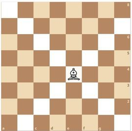
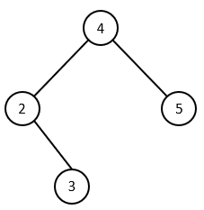
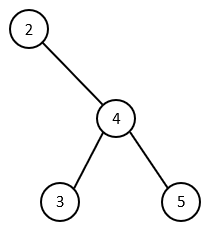

# Soal Praktikum 3 Kelas E
## Daftar Isi
- [Covered Zone - CZ](#covered-zone)
- [Check The Tree - CTT](#check-the-tree)
- [Part Time - PT](#part-time)
- [Hana Bucin - HB](#hana-bucin)

## Covered Zone
| Time Limit | Memory Limit |
|---|---|
| 1 seconds | 64 MB |

Alex has a chessboard sized n x n. On the board will be put several bishops. In chess, the bishop attacks all squares on the same diagonal. Alex wondered how many squares attacked by the bishop.



#### Input Format
The first line contains two integers n and m which represents the size of board and the number of bishops. The next m lines contains a pair of integer ai and bi represents the position of row and column where the bishops number i is located.

#### Constraints
* 1 ≤ m, n ≤ 10<sup>6</sup>
* 1 ≤ a<sub>i</sub>, b<sub>i</sub> ≤ 10<sup>6</sup>

#### Output Format
Print the number of squares attacked by the bishops.

#### Sample Input 0
```c
10 4
1 7
9 8
1 1
3 1
```

#### Sample Output 0
```c
39
```

#### Sample Input 1
```c
8 1
5 4
```

#### Sample Output 1
```c
14
```

## Check The Tree
| Time Limit | Memory Limit |
|---|---|
| 1 seconds | 64 MB |

Given a tree, check whether it is a balanced bst or not, using the is_valid function (without adding more library, modifying the struct, insert function, and main).

#### Input Format
The input is handled for you by the code in the editor. So you don't have to worry about it

#### Constraints
* 0 ≤ N ≤ 100
* 0 ≤ val ≤ 2147483647

#### Output Format
In the bool is_valid() function, you must return the the value true if the given tree is a balanced bst, or false if it is not.

The code in the editor will print "YES" if you return true or it will print "NO" if you return false.

#### Sample Input 0
```c
4
4 2 5 -1 3
```

#### Sample Output 0
```c
YES
```

#### Explanation 0
The given tree are looks like this:



It is a Balance BST

#### Sample Input 1
```c
4
2 -1 4 3 5
```

#### Sample Output 1
```c
NO
```

#### Explanation 1
The given tree looks like this:



It is not a Balanced BST

## Part Time
| Time Limit | Memory Limit |
|---|---|
| 1 seconds | 64 MB |

Lily sedang berkerja part time di toko dekat rumahnya. Tugasnya adalah mengarsip semua barang beserta harganya. Agar memudahkan, barang-barang tersebut ia beri id yang urut dimulai dari 1. Setelah mengarsip barang, ia juga harus menghitung berapa banyak pendapatan toko hari ini. Hal itu didapatkan dari menjumlah pendapatan dari tiap transaksi yang berlangsung pada hari itu. Bantulah Lily menghitung pendapatan hari ini!

#### Input Format
Baris pertama terdiri dari 2 integer yaitu M (banyak barang) dan N (banyak transaksi).

Baris selanjutnya terdiri dari M-baris yang berisi P (id barang) dan Q (harga).

Saat mengisikan P, P haruslah urut dan dimulai dari 1.

Q adalah harga barang dan berupa integer.

Baris selanjutnya terdiri dari N-baris yang terdiri dari X (banyak barang yang dibeli) dan Y (id barang yang dibeli).

#### Constraints
M, N, P, Q, X, Y = Integer

#### Output Format
Output Z(total pendapatan) yang berupa integer

Maaf barang tidak tersedia -> penjelasan lihat contoh testcase

ID harus urut -> penjelasan lihat contoh testcase

#### Sample Input 0
```c
10 7
1 65000
2 13700
4 37800
```

#### Sample Output 0
```c
ID harus urut
```

#### Explanation 0
Ketika ID tidak urut maka akan langsung keluar dari program

#### Sample Input 1
```c
5 5
1 13000
2 5500
3 8750
4 21900
5 30000
4 4
2 3
2 1
1 7
3 2
```

#### Sample Output 1
```c
Maaf barang tidak tersedia
147600
```

#### Explanation 1
Tidak ada barang dengan ID 7

## Hana Bucin
| Time Limit | Memory Limit |
|---|---|
| 1 seconds | 64 MB |

Hana adalah seorang penjelajah galaxy, dia ingin menemui pujaan hatinya yang sedang berada di galaxy lain. Setiap galaxy memiliki k jarak, sebagai penanda jarak yang harus ditempuh dari satu galaxy sebelumnya ke galaxy tersebut. Karena ia harus pergi ke galaxy dimana doi berada, maka ia mencari tahu apakah ada jalan ke galaxy tersebut dengan N jaraknya. Setiap galaxy hanya mempunyai 2 jalan ke galaxy lain, dimana yang satu selalu lebih pendek dari jarak satunya, dan galaxy dengan jarak pendek selalu berkumpul dengan galaxy lain yang jaraknya pendek. Namun banyak galaxy yang harus ditempuh dari galaxy satu ke galaxy lain selalu sama atau maksimal hanya selisih satu. Bantu Hana mencari tahu apakah ada jalan dengan jarak N yang pas agar dia tidak datang terlambat ataupun duluan. Dengan syarat jarak galaxy yang ditempuh tidak boleh backtrack.

#### Input Format
Input diawali dengan N banyak testcase

Setiap testcase bisa mengquery 1 atau 2

Setiap query diikuti oleh bilangan k,

1 k berarti Hana mendapatkan galaxy lain yang harus ia tempuh sejauh k, dengan galaxy yang memiliki jarak yang sama akan dianggap tidak ada

2 k berarti Hana mencari tahu apakah ada jarak sebesar k dari satu galaxy ke galaxy lain, dengan syarat galaxy tersebut hanya menggunakan satu jalan saja

#### Constraints
* 1 < N < 10000 
* 0 < k < 1000000

#### Output Format
setiap query 2, print

"```<3```" apabila ada jalan sejauh k

"```<>```" apabila tidak ada jalan yang bisa ia lewati

Diikuti dengan endline

#### Sample Input 0
```c
8
1 2
2 1
1 1
2 1
1 3
2 3
2 5
2 6
```

#### Sample Output 0
```c
<>
<3
<3
<3
<>
```

#### Explanation 0
Untuk 2 1, karena tidak ada galaksi berjarak 1, maka Hana tidak menemukan jalan

Untuk 2 5, karena ada jalan sejauh 5, dari galaksi dengan k=2 lalu ke galaksi dengan k=3
```c
  2

/   \

1   3
```
k = 2 -> k = 3

Untuk 2 6, karena ada jalan sejauh 6, namun ia menempuh k=1, k=2, k=3, maka kombinasi jalan nya sebagai berikut
```c
  2

/   \

1   3
```
k = 2 -> k = 1 -> k = 2 -> k = 3

Karena jalur galaksi 2 dilewati dua kali (backtrack), maka Hana tidak bisa menemukan jalan
