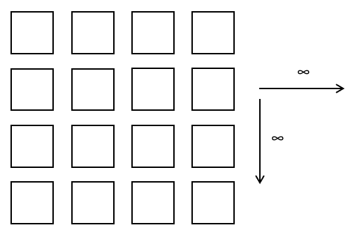
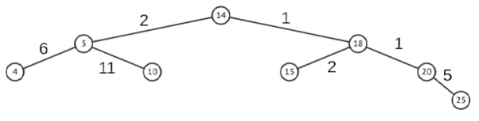

# Soal Praktikum 2 Kelas F
## Daftar isi
- [Brembo dan Lahan Baru 2 - BLAND2](#brembo-dan-lahan-baru-2)
- [Brembo dan BST Lamp - BSTLAMP](#brembo-dan-bst-lamp)
- [Luffy Menemukan Pohon Buah Setan - LMBS](#luffy-menemukan-pohon-buah-setan)
- [Mahmood Terjebak di Penjara - MTDP](#mahmood-terjebak-di-penjara)
- [Silsilah Keluarga MudMud - SKM](#silsilah-keluarga-mudmud)

## Brembo dan Lahan Baru 2
| Time Limit | Memory Limit |
|---|:---|
| 0.3 seconds	| 32 MB |

Setelah sukses sebagai petani, kini lahan Brembo telah berkembang pesat. Saat ini, ia memiliki lahan baru tak jauh dari tempat tinggalnya. Lahan baru Brembo berbentuk berbeda dari sebelumnya dengan luas ∞ hektare. Jika diilustrasikan, lahan baru Brembo berbentuk seperti gambar di bawah.



_Satu kotak menggambarkan satu lahan_

Brembo juga bekerja sebagai **Primary Botanist** di **Tece 19 Institute**. Disini, Brembo akan diberikan N daftar kerja dengan gajinya masing-masing (s_i). Ia diharuskan memilih setidaknya satu pekerjaan yang tersedia dari daftar. Jika ia memilih lebih dari satu pekerjaan, maka pekerjaan-pekerjaan tersebut haruslah berurutan dalam daftar. Selain itu, Brembo juga diberikan M kesempatan untuk mengubah gaji pekerjaan i (s_i). Diterapkan juga sistem asuransi dengan cara memotong sebanyak f(x) mod 10001 dari gaji pada masing-masing pekerjaan yang telah dipilih. Fungsi f(x) sendiri didapatkan dari :


Fungsi `g(k)` untuk setiap `k` dihitung dari aturan berikut :
1. `s` bilangan bulat dengan nilai awal 1 dan bilangan bulat `p` dengan nilai awal `k`
2. `i` bilangan bulat dimana 2 ≤ `i` ≤ `p`
3. Dengan menggunakan perulangan, dimulai dari `i` = 2 hingga `i` ≤ `p` (bertambah 1). Jika `i` adalah bilangan prima, lakukan berikut :
```
temp = 1
while p mod i is 0, then:
    p=p/i
    temp = temp + 1
s = s * temp
```
4. Langkah 3 berakhir ketika kondisi tidak memenuhi perulangan

Kemudian, cek nilai `s` ganjil atau genap. Jika ganjil, ubah `g(k)` = `k` sebaliknya jika genap, ubah `g(k)` = 0.

Brembo ingin memasang pagar pada lahan barunya menggunakan gaji pertama hasil bekerja di perusahaan tersebut. Sama seperti lahan sebelumnya, ia hanya mau menggunakan jumlah pagar seminimum mungkin. Untuk itulah, Brembo telah membuat sebanyak Q skenario perhitungan. Terdapat dua jenis skenario, meliputi :
1. Menggunakan hak untuk mengubah gaji pada pekerjaan ke-i (s_i), atau
2. Menghitung maksimum lahan yang dapat dipagari jika ia memilih pekerjaan i hingga j (i,j).
Untuk mempermudah perhitungan, ia memutuskan untuk membuat program sederhana untuk mengetahui hasil dari masing-masing skenario.
> Challenge: Kerjakan soal ini tanpa menggunakan alokasi dinamis/heap.

#### Format Input
Baris pertama terdapat bilangan N,M dan x. Masing-masing adalah banyaknya daftar pekerjaan, banyaknya kesempatan untuk mengubah gaji dan biaya asuransi `f(x)`. Pada baris kedua, terdapat bilangan s<sub>1</sub>,s<sub>2</sub>,s<sub>3</sub>,…,s<sub>N</sub> yang menyatakan gaji untuk masing-masing pekerjaan (dipisahkan spasi). Baris ketiga adalah Q, jumlah skenario.

Q baris berikutnya adalah deskripsi skenario. Masing-masing formatnya dapat berupa :
* `1 i X`, yakni mengubah gaji pekerjaan ke-i (s<sub>i</sub>) 1≤`i`≤`N` dengan nilai `X`.
* `2 i j`, yakni menghitung berapa maksimum lahan yang bisa dibangun pagar sesuai pada deskripsi (1≤`i`≤`j`≤`N`).

#### Format Output
Pada masing-masing skenario, cetak output berupa string “Kasus #x: ” dimana x adalah skenario ke-x dimulai dari 1 kemudian diikuti dengan  :
* Untuk skenario jenis 1, cetak string “ok” jika berhasil mengubah gaji, sebaliknya cetak “gagal” jika gagal.
* Sedangkan skenario jenis 2, cetak satu bilangan berupa maksimum lahan yang bisa dibangun pagar.

#### Contoh Input
```c
5 1 3
6 7 4 10 12
5
2 1 3
1 1 11
2 1 3
1 4 15
2 2 5
```

#### Contoh Output
```c
Kasus #1: 4
Kasus #2: ok
Kasus #3: 6
Kasus #4: gagal
Kasus #5: 11
```

##### Batasan
* 1<N,Q≤10^6
* 1≤M≤10^5
* 1≤K≤10^4
* 1≤s_i≤10^8
* Skenario 1: 1≤i≤N dan 1≤X≤10^8
* Skenario 2: 1≤i≤j≤N

## Brembo dan BST Lamp
| Time Limit | Memory Limit |
|---|:---|
| 1 seconds	| 1536 MB |

Saat ini Brembo diminta untuk membuat sebuah aplikasi berbasis CLI oleh **Tece 19 Institute**. Teknisi senior dalam Tece 19 Institute sedang mengembangkan suatu metode yang menarik untuk memperkenalkan struktur data _Binary Search Tree_. Metodenya adalah dengan membuat struktur perangkat terdiri dari benda/objek yang kemudian disusun sesuai aturan _Binary Search Tree_.

Teknisi senior Tece 19 Institute tidak mengetahui banyak hal mengenai pemrograman antarmuka. Yang mereka tahu adlah mengenai hardware dan sedikit pengetahuan dalam _hardware-programming_. Untuk itulah, Brembo (sebagai programmer handal) dipercaya untuk membuatkan aplikasi antarmuka berbasis Command Line Interface untuk mengontrol perangkat tersebut.

Spesifikasi program yang dibutuhkan adalah sebagai berikut : 

### Spesifikasi Program BST Lamp Controller
#### Detail Program
| Nama Program | BST Lamp Controller |
| --- | --- |
| Jenis Antarmuka | Command Line Interface |
| Versi | 1.0.0 |

#### Overview

***BST Lamp Controller*** adalah program berbasisi CLI yang digunakan untuk melakukan pengontrolan dan virtualisasi terhadap alat controller yang terhubung dengan susunan suatu himpunan lampu yang disusun mengikuti aturan tertentu. Struktur lampu-lampu tersebut disusun sedemikan rupa membentuk struktur sebuah Binary Search Tree (BST) yang kemudian dinamakan **BST Lamp**.

Tujuan dibentuknya struktur BST Lamp ini adalah untuk mengedukasi dan menunjukkan struktur Binary Search Tree agar menarik dan mudah untuk dipelajari. Berikut adalah contoh gambaran sederhana sebuah BST Lamp.


#### Detail Lampu

Sebuah lampu pada BST Lamp mempunyai komponen-komponen sebagai berikut:

- Bilangan bulat positif, yang digunakan untu membedakan lampu satu dengan lampu lainnya dan menandakan kebutuhan daya untuk lampu tersebut.
- Dua buah port yang mempunyai kabel pada masing-masing portnya dapat diekstensi (disambungkan) menuju lampu lain.
- Satu buah port yang digunakan untuk menerima ekstensi kabel dari kabel lain.
- Daya listrik dialirkan dari lampu paling atas, sehingga lampu-lampu di bawahnya hanya akan menyala apabila lampu di atasnya dipastikan tidak rusak/dapat mengalirkan listrik.

BST Lamp ini hanya bisa mengakomodasi lampu-lampu yang unik (tidak ada duplikasi).

#### Initial Runtime

Saat program pertama kali dijalankan, akan muncul output pesan berupa:
```
Initializing application...
Insert your initial configuration:
```

Kemudian baris berikutnya adalah input bentuk awal BST Lamp. Input awal terdiri dari bilangan bulat positif sebanyak-banyaknya (paling tidak satu buah bilangan) yang dipisahkan spasi. Input selesai apabila tombol `Enter` ditekan yang kemudian menampilkan output:
```
Starting interactive shell...
```

Perintah-perintah (command) dapat mulai diinputkan dibaris setelah itu.

#### Daftar Perintah

---

- ##### **`install`**
    

    **Sintaks**
    ```
    install <arg>
    ```
    Perintah `install` digunakan untuk mem-virtualisasikan pemasangan lampu baru pada struktur BST Lamp yang telah ada.


    **Argumen:**
    + **`<arg>`** merupakan argumen berupa bilangan bulat positif. Misal 2, 3, 14, dsb.

    **Normal Output**

    Jika lampu berhasil dipasang

    ```
    >> Lamp <arg> installed

    ```

    Jika lampu sudah pernah dipasang

    ```
    >> Lamp <arg> already exist

    ```

    ---
- ##### **`inspect`**


    **Sintaks**
    
    ```
    inspect [option]
    ```
    Perintah inspect digunakan untuk melihat status terkini lampu.

    **Argumen:**

    > Argumen `[option]` bersifat opsional, dapat dituliskan atau tidak. Apabila tidak dituliskan, akan otomatis menggunakan `--all`.

    + **`--all`**
        
        Digunakan untuk melihat status untuk dua poin selanjutnya sekaligus. Hasil dari `--longestCable` diikuti `--cableCount`.
    + **`--longestCable`**
        
        Digunakan untuk menghitung panjang dari kabel terpanjang yang terpasang (dihitung dari tempat lampu paling atas) hingga lampu terbawah.
    + **`--cableCount`**
        
        Digunakan untuk menghitung banyaknya kabel yang terkoneksi sekarang.

    **Normal Output**

    **`--all`**
    ```
    >> Longest cable: <number>
    >> Interconnected cable: <number>

    ```


    **`--longestCable`**
    ```
    >> Longest cable: <number>

    ```

    **`--cableCount`**
    ```
    >> Interconnected cable: <number>

    ```
    > Note: **`<number>`** merupakan suatu bilangan bulat sesuai dengan deskripsi perintah.

    ---
- ##### **`analyze`**


    **Sintaks :**
    
    ```
    analyze <option>
    ```

    Perintah `analyze` digunakan untuk menganalisis keadaan lampu yang terpasang pada BST yang sekarang. Untuk saat ini hanya dapat menganalisis dua hal, yakni:

    1. Mencari lampu pertama (dihitung dari lampu paling atas) yang kemungkinan menyebabkan N lampu bermasalah/mati/rusak.

    2. Mencari dua lampu A dan B yang mempunyai jumlahan daya tepat X. Dalam hal ini, A dan B masing-masing merupakan lampu dengan daya terkecil dan lampu dengan daya terbesar.


    > Argumen `<option>` harus dispesifikan.

    **Argumen:**

    + **`--brokenLamp <args...>`**

        Menjalankan perintah spesifik untuk **poin 1** di atas. Argumen `<args...>` menerima bilangan bulat sebanyak-banyaknya dipisahkan spasi.

    + **`--totalPower <arg>`**

        Menjalankan perintah spesifik untuk **poin 2** di atas. Argumen `<arg>` merupakan bilangan **X**.

    **Normal Output**

    Perintah **`--brokenLamp <args...>`**
    
    Jika banyaknya yang dianalisis lebih dari 1, maka:
    ```
    >> There might be a problem with cable on the lamp <number> and so on

    ```

    Jika banyaknya yang dianalisis hanya 1, maka:
    ```
    >> Only a lamp inserted. You need minimum of two lamps

    ```

    Perintah **`-- totalPower <arg>`**
    ```
    >> Lamp with total of <X> are <A> and <B>

    ```
    > `<X>`, `<A>`, dan `<B>` masing-masing adalah bilangan bulat sesuai pada deskripsi perintah.

    Apabila memang tidak ada lampu yang memenuhi, akan mencetak pesan error:

    ```
    >> No lamps found

    ```

    ---

- ##### `exit`

    **Sintaks :**

    ```
    exit
    ```
    Digunakan untuk mengakhiri program dan keluar dari program.

    **Normal Output**
    ```
    >> Exiting application

    ```

#### Asumsi Input

Pada bagian ini, developer dapat menganggap bahwa beberapa input dapat diasumsikan pasti benar. Input-input tersebut termasuk dalam:

- Bilangan bulat lampu diasumsikan selalu positif kurang dari 1000.
- Input awal konfigurasi BST Lamp diasumsikan benar (minimal satu lampu).
- Argumen perintah `analyze` diasumsikan pasti ada lampu yang dianalisis.

#### Error Handling

Selain daftar perintah di atas, program juga dapat menangani error ketika user salah meng-inputkan sesuatu atau salah meng-inputkan perintah.

- ##### CommandError Exception

    Command Error terjadi ketika perintah yang dimasukkan tidak terdapat dalam daftar/tidak dikenali. Dalam hal ini, program akan mencetak pesan error sebagai berikut.

    ```
    >> Error: unrecognized command

    ```

- ##### ArgumentError Exception

    Argument Error terjadi ketika memasukkan perintah tanpa argumen dan/atau argumen tidak sesuai. Argument Error dibagi berdasarkan perintah yang dimaksud.

    + Perintah **`install`**

        Ketika argumen tidak disertakan, maka akan mencetak pesan error:

        ```
        >> Error: argument required -> [lamp_power]
            
            install <lamp_power>

        ```
    + Perintah **`inspect`**

        Ketika memasukkan argumen yang tidak dikenali, maka akan mencetak pesan error:
        ```
        >> Error: invalid argument

        ```

    + Perintah **`analyze`**

        Ketika memasukkan perintah tanpa argumen, maka akan mencetak pesan error:
        ```
        >> Error: argument required -> [options]
        >> You can try one of the following options:

            analyze --brokenLamp <args...>
            analyze --totalPower <arg>
        
        ```

        Ketika memasukkan argumen yang tidak dikenali, maka akan mencetak pesan error:
        ```
        >> Error: invalid argument

        ```

- ##### LogicalError Exception

    Logical Error terjadi ketika argumen yang dimasukkan tidak ditemukan. Dalam hal ini hanya terdapat pada perintah **`analyze --brokenLamp`**.

    Jika dalam menjalankan perintah tersebut, terdapat paling tidak 1 saja argumen yang tidak ditemukan dalam BST Lamp, maka akan mencetak pesan error:
    ```
    >> Error: lamp(s) not found

    ```

#### Exit Process

Setelah program diberhentikan, maka akan muncul pesan terakhir seperti berikut.
```
Application stopped
```

Brembo harus bisa membuat program CLI sesuai dengan dokumen spesifikasi tersebut.

> Note : Dalam soal ini anda tidak akan diberikan contoh input, output dan penjelasan. Anda harus mengandalkan dokumen spesifikasi yang diberikan untuk membuat program.

## Luffy Menemukan Pohon Buah Setan
| Time Limit | Memory Limit |
|---|:---|
| 1 seconds	| 31 MB |


Luffy menemukan pohon buah setan!!! Untuk mempersiapkan melawan Kaido, Luffy membutuhkan banyak buah setan untuk memperkuat armadanya sebelum peperangan besar melawan Beast Pirates. Tetapi penjaga pohon itu memberikan beberapa syarat dan command agar Luffy bisa mengambil buahnya, diantaranya :
- Dengan command 'inorder' diharuskan menyebutkan buah secara inorder
- Dengan command 'postorder' diharuskan menyebutkan buah secara postorder
- Dengan command 'preorder' diharuskan menyebutkan buah secara preorder
- Dengan syarat 'genap' menyebutkan buah dengan angka genap
- Dengan syarat 'ganjil' menyebutkan buah dengan angka ganjil
- Dengan syarat 'prima' menyebutkan buah dengan angka prima
- Dengan syarat 'semua' menyebutkan semua buah

Karena Luffy harus bergegas melawan Beast Pirates, maka bantulah ia agar bisa menang melawan Beast Pirates.

#### Input Format
Beberapa angka sampai bertemu -1. Lalu sebuah baris angka n yang merupakan jumlah baris command dan syarat akan
dimasukkan. Lalu n baris syarat dan command.

#### Output Format
Keluaran sesuai dengan command dan syarat

#### Sample Input
```c
1
4
5
6
3
2
4
2
3
-1
3
inorder genap
postorder genap
preorder prima
```

#### Sample Output
```c
Command : #1
2
4
6
Command : #2
2
6
4
Command : #3
3
2
5
```

#### Constraints
Semua angka berada dalam range integer

## Mahmood Terjebak di Penjara
| Time Limit | Memory Limit |
|---|:---|
| 1 seconds	| 32 MB |



Sungguh malang nasib Mahmood kali ini. Dia terjebak di dalam sebuah penjara yang sangat luas. Dia menangis ketakutan dan ingin segera keluar dari penjara tersebut.

Penjara tersebut mempunyai bentuk dan struktur yang tersusun mirip seperti Binary Search Tree. Terdapat N sel yang mana setiap sel diberi nomor tertentu dan terdapat jalur yang menghubungkan ke satu atau dua sel lain di bawahnya. Salah satu sel dari N sel tersebut berperan sebagai sel root.

Mahmood ingin segera keluar dari penjara tersebut karena ia trauma akan suasana penjara. Ia mengetahui bahwa pintu keluar dari penjara tersebut terletak pada semua sel paling bawah (sel leaf). Namun masalahnya adalah jarak dari satu sel menuju sel lain berbeda-beda. 

Berbekal dengan peta penjara yang ia punya, dapatkah kamu membantu Mahmood untuk keluar dari penjara melalui pintu keluar terdekat?

Gambar berikut menunjukkan peta penjara dari contoh input.

#### Input Format
Input baris pertama adalah N, yang menunjukkan banyaknya sel. Kemudian, baris kedua terdapat bilangan M yang merupakan nomor sel root. N-1 baris selanjutnya berisi dua bilangan ai dan si. 
* ai merupakan nomor sel.
* bi merupakan jarak sel ai menuju sel parent-nya.

Struktur BST dibentuk berdasarkan urutan input.

Setelah itu terdapat Q, yang merupakan banyaknya kasus uji. Q baris selanjutnya terdapat satu bilangan yang menandakan
nomor sel dimana brembo saat ini berada.

#### Output Format
Terdapat Q baris bilangan yang merupakan jarak menuju pintu keluar terdekat yang ditempuh Mahmood untuk keluar dari
penjara.

#### Sample Input
```c
8
14
5 2
10 11
4 6
18 1
15 2
20 1
25 5
4
14
4
5
15
```

#### Sample Output
```c
3
0
5
0
```

#### Constraints
1 ≤ N ≤ 10^5 \
1 ≤ Q ≤ 10^5 \
Nilai ai dijamin berbeda (unik)

## Silsilah Keluarga MudMud
| Time Limit | Memory Limit |
|---|:---|
| 1 seconds	| 8 MB |


MudMud mempunyai keluarga yang sangat besar, dia sedang kebingungan tentang silsilah keluarganya. Dia tidak bisa tahu mana anak dan mana ibunya. Bantu ia menemukan mana anak dan mana orangtua dari keluarga besanya

#### Input Format
Baris pertama berisi sebuah bilangan Q yang merupakan banyak query

Q baris berikutnya berisi salah satu dari 2 tipe query berikut:

* "1 K" berarti bilangan K dimasukkan ke dalam BST
* "2 S X" jika S adalah pernyataan yang seperti dijelaskan di deskripsi. X pasti ada di dalam BST

#### Output Format
Untuk setiap query tipe 2:

Jika S adalah "anaK" keluarkan child dari node dipisahkan dengan spasi "A B", A adalah anak kiri dan B adalah anak kanan. Jika salah satu tidak ada keluarkan "-". Jika sama sekali tidak memiliki anak berhenti memproses dan keluarkan "diManakah Anak-aNakkuu :(".

Jika S adalah "ibU" keluarkan parent dari node, jika node adalah root keluarkan "Aku adalaH sesepuH"

#### Sample Input
```c
7
1 2
1 1
2 anaK 2
1 3
2 ibU 1
2 anaK 2
2 anaK 1
```

Sample Output
```c
1 -
2
1 3
diManakah Anak-aNakkuu :(
```

#### Constraints
1 ≤ Q, K ≤ 100
