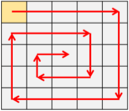
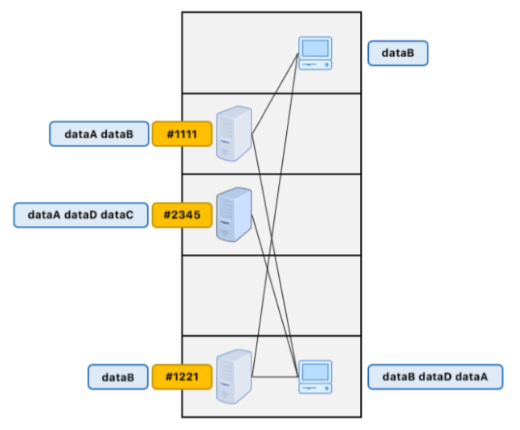

# Soal Praktikum 3 Kelas F
## Daftar Isi
- [A](#a)
- [B](#b)
- [C](#c)
- [D](#d)
- [E](#e)

## A
| Time Limit | Memory Limit |
|---|---|
| 70 ms | 1536 MB |

Diberikan sebuah grid berukuran 𝑁 x 𝑀 dimana setiap kotaknya dapat berisi karakter ‘A’-‘Z’ atau karakter ‘.’ yang menunjukkan ruang kosong. Kamu hendak melakukan penelusuran pada grid tersebut. Perhatikan ilustrasi di bawah. 



Penelusuran dimulai dari kotak paling **kiri-atas** dan berjalan seperti pada gambar. Tujuan dari penelusurannya adalah untuk mencari karakter-karakter dalam satu kelompok yang nantinya dibentuk sebuah string. Jika menemukan karakter, maka kamu akan mencari karakter-karakter lain yang dalam satu kelompok dengan: 
* Saat berada dalam kotak yang berisi karakter, prioritas arah pencarian yakni **ke kanan > ke bawah > ke kiri > ke atas**. 
* Saat pencarian, kamu akan mengabaikan kotak kosong dan berpindah arah sesuai prioritas. 
* Karakter yang ditemukan dirangkai menjadi sebuah string sesuai dengan urutan yang ditemukan. 
* Dua karakter dikatakan berada dalam satu kelompok jika kotak berada berdekatan dalam arah kanan, kiri, atas atau bawah. 
Setelah itu, kamu menghitung **berapa kali suatu string muncul** dari hasil penelusuran dan diurutkan sesuai urutan lexicographic string. Kemudian, dari string yang telah terurut, kamu juga ingin mencari tahu **indeks dari karakter 𝒀 yang muncul ke-𝒁 pada string ke-𝑿** (*1-based index*, mulai dari kiri). 

#### Format Input 
Baris pertama adalah 𝑁 dan 𝑀. Kemudian diikuti oleh 𝑁 bari berisi 𝑀 karakter (tanpa spasi). Setelah itu terdapat 𝑄 yakni banyaknya kueri. 𝑄 baris berikutnya adalah detail kueri. Untuk setiap kueri, terdapat tiga bilangan 𝑋, 𝑌 dan 𝑍. 

#### Format Output 
Setelah selesai menginputkan karakter-karakter *grid*, maka cetak jumlah kemunculan suatu string dalam format: 

```[string] [jumlah kemunculan]``` (satu baris untuk setiap string) 

Kemudian, setiap kali menginputkan kueri, cetak satu bilangan yang merupakan jawaban dari pertanyaan pada deskripsi soal. Jika jawaban kueri tidak ada, maka cetak -1. 

#### Contoh 
#### Input 
```c
8 8 
SYAF.U.A 
.QI....B 
....M..I 
.KOSI..Y 
.......A 
.KOSIM.S 
.......A 
TCC.ATIB 
3 
1 A 3 
2 S 2 
4 Q 1 
```
 
#### Output 
```c
ABIYASABITA 1 
CCT 1 
KOSIM 2 
SYAFIQ 1 
U 1 
7 
-1 
6 
```
 
#### Batasan 
* 2 ≤ 𝑁,𝑀 ≤ 500 
* 1 ≤ 𝑄 ≤ 50000 
* 1 ≤ 𝑋 ≤ banyaknya string yang didapat dari hasil penelusuran 
* 𝑌 merupakan karakter ‘A’ – ‘Z’ 
* 𝑍 merupakan bilangan bulat positif  

## B
| Time Limit | Memory Limit |
|---|---|
| 100 ms | 1536 MB |

Diberikan 𝑁 buah string yang terdiri dari karakter [‘**a**’, ‘**b**’, ‘**c**’, ‘**d**’] dengan panjang yang bervariasi (panjang maksimal adalah 20 karakter). Dari kumpulan-kumpulan string tersebut, kamu hendak melakukan simulasi pencarian mirip seperti Search-Engine. Satu pencarian adalah satu kueri yang berisi satu string kueri yang hendak dicari. Mekanisme pencariannya adalah sebagai berikut: 
* Pencarian dilakukan dengan mencari semua string unik yang berawalan dengan string kueri atau string kueri itu sendiri. Kemudian diurutkan sesuai urutan lexicographic. 
* Selain itu, dihitung juga bilangan 𝑋, yakni berapa kali string kueri telah diinputkan sebagai awalan atau sebagai string itu sendiri dari 𝑁 buah string yang diberikan di awal. 

#### Format Input 
Baris pertama input adalah bilangan bulat 𝑁, jumlah string. Kemudian, 𝑁 baris selanjutya berisi string yang telah dijelaskan. Setelah 𝑁 string diinputkan, sekarang adalah proses untuk kueri. Baris berikutnya adalah bilangan bulat 𝑄, jumlah kueri. Setiap kueri dideskripsikan pada baris terpisah yang terdiri dari string tunggal (string kueri). 

#### Format Output 
Untuk setiap kueri, cetak string "**Kasus #i:** " di mana i adalah kueri ke-i (mulai dari 1) diikuti oleh bilangan 𝑋 jika ada, dan kemudian baris berikutnya adalah daftar hasil pencarian (satu baris untuk setiap string) dalam urutan lexicographic. Jika tidak ada yang cocok, cetak “Tidak ada hasil”. 

#### Contoh 
#### Input 
```c
6 
a 
ab 
aab 
aab 
aabc 
abdca 
3 
a 
ab 
bca 
```
 
#### Output 
```c
Kasus #1: 6 
a 
aab 
aabc 
ab 
abdca 
Kasus #2: 2 
ab 
abdca 
Kasus #3: Tidak ada hasil 
```

#### Batasan 
* 1 ≤ 𝑁 ≤ 10000 
* 2 ≤ 𝑄 ≤ 100 

## C
| Time Limit | Memory Limit |
|---|---|
| 500 ms | 1536 MB |

Membangun *Local Area Network* merupakan salah satu solusi ketika hendak membangun jaringan berskala lokal di area seperti gedung, perkantoran, sekolah dsb. Kali ini, sebuah kantor perusahaan mempunyai komputer server sebanyak 𝑁 buah yang tiap komputernya diwakili oleh sebuah id berupa string. Data-data perusahaan disimpan didalam komputer server, namun tidak semua server mempunyai data yang sama. 



Terdapat 𝑀 buah komputer client yang beroperasi setiap harinya. Komputer-komputer client tersebut membutuhkan data dari komputer server, namun tidak semua client membutuhkan data yang sama. Ketika komputer client membutuhkan data tertentu, maka komputer tersebut akan **membuat koneksi kepada semua server yang mempunyai data yang dibutuhkan**. 

Komputer server maupun komputer client tersebar di lantai yang berbeda-beda. Kamu hendak melakukan analisis terhadap keandalan transfer data pada jaringan tersebut. Kamu ingin mengetahui **berapa total koneksi yang dibuat oleh 𝑴 komputer client** kepada server dan **urutan data** yang datang ke masing-masing client. Data akan lebih cepat terkirim apabila jarak antar dua komputer (jarak antar lantai) semakin dekat. 

#### Format Input 
Pertama terdapat 𝑁 yakni banyaknya komputer server. Baris selanjutnya adalah deskripsi masingmasing server. Setiap server dideskripsikan pada dua baris yang berisi: 
1. ```[id_server] [banyaknya data disimpan] [nomor lantai server berada]``` 
2. ```[nama data 1] [nama data 2] .... [nama data terakhir]``` 
 
Kemudian baris selanjutnya adalah deskripsi komputer client. Pertama adalah 𝑀 yakni banyaknya komputer client. Masing-masing komputer client (client ke-i, dimulai dari 1) dideskripsikan pada dua baris yaitu: 
1. ```[banyaknya kebutuhan data] [nomor lantai client berada]``` 
2. ```[nama data 1] [nama data 2] .... [nama data terakhir]``` 

#### Format Output 
Untuk setiap client, cetak diawali oleh string “**Client i:**”. Kemudian baris-baris selanjutnya berisi urutan data yang datang pada client tersebut. Jika terdapat lebih dari satu data yang datang bersamaan, maka cetak sesuai urutan lexicographic. Setelah semua client selesai dicetak, baris paling terakhir adalah string “**Total koneksi:** “ diikuti oleh banyaknya koneksi yang dibuat oleh semua client. Contoh 

#### Input 
```c
3 
#1221 2 4 
dataA dataB 
#2345 3 3 
dataA dataD dataC 
#1111 1 1 
dataB 
2 
3 1 
dataB dataD dataA 
1 5 
dataB 
```

#### Output 
```c
Client 1: 
dataB 
dataA 
dataD 
Client 2: 
dataB 
Total Koneksi: 5 
```

#### Batasan 
* 1 ≤ 𝑁,𝑀 ≤ 1000 
* id server berisi karakter ‘#’ dan ‘0’-‘9’. 
* nama data terdiri dari huruf alphabet. 
* 1 ≤ banyak data yang disimpan/dibutuhkan ≤ 100 

## D
| Time Limit | Memory Limit |
|---|---|
| 1 s | 1536 MB |

Diberikan sebuah catatan yang berisi daftar nama murid. Namun, catatan tersebut diketik dengan terburu-buru sehingga terdapat kemungkinan ada nama murid diketik lebih dari sekali (duplikat). Selain itu, penulisannya juga tidak begitu rapi dan menyebabkan: 
* Nama murid tidak urut sesuai abjad, 
* Strukturnya sangat berantakan (banyak whitespace yang tidak perlu). 

Kamu hendak memasukkan daftar nama murid tersebut ke dalam komputer. Dari catatan tersebut, kamu akan mengurutkan nama-namanya sehingga mudah dibaca dan membuat format khusus bernama *UniFormat*. 
*UniFormat* adalah sebuah string dengan format 
**```[string1]_[string2]_[string3]........._[stringN]```** untuk N string. 

#### Format Input 
Tidak ada format mutlak dalam memasukkan input. Yang pasti, input yang diberikan berupa karakter huruf alphabet (*uppercase* dan/atau *lowercase*) dan *whitespace*. Nama murid terdiri dari satu kata. 

#### Format Output 
Output berupa daftar string unik yang telah terurut (sesuai ASCII) didapatkan dari catatan. Setiap string dicetak dalam satu baris diawali penomoran (urutan ke-i) dimulai dari 1. Kemudian baris terakhir merupakan bentuk *UniFormat*-nya. 

#### Contoh 
#### Input 
```c
   Bayu      Zaldi    
Putri  Aqil      Putri 
 
Irwanda 
  Syafiq 
 
```
 
#### Output 
```c
1. Aqil 
2. Bayu 
3. Irwanda 
4. Putri 
5. Syafiq 
6. Zaldi 
Aqil_Bayu_Irwanda_Putri_Syafiq_Zaldi
```  

## E
| Time Limit | Memory Limit |
|---|---|
| 120 ms | 1536 MB |

Diberikan string sebanyak 𝑁 yang terdiri dari karakter digit dan/atau huruf *uppercase*. Dua buah string 𝑥 dan 𝑦 dikatakan sepasang 𝑝𝑎𝑖𝑟(𝑥,𝑦) apabila dalam string 𝑥 dan string 𝑦 terdapat setidaknya satu karakter yang sama. Hitunglah berapa banyaknya pasangan 𝑝𝑎𝑖𝑟(𝑥,𝑦) dari 𝑁 string tersebut. Hitunglah hasilnya dalam modulo 10<sup>9</sup> + 7. 

#### Format Input 
Baris pertama input adalah 𝑁, takni banyaknya string. Kemudian, 𝑁 baris berikutnya berisi satu string yang telah dijelaskan pada deskripsi. 

#### Format Output 
Cetak satu bilangan banyaknya pasangan 𝑝𝑎𝑖𝑟(𝑥,𝑦) dalam modulo 10<sup>9</sup> + 7. 

#### Contoh 
#### Input 
```c
4 
23A 
AB 
C45 
332AB
``` 
 
#### Output 
```
3 
```
 
#### Batasan 
* 2 ≤ 𝑁 ≤ 10<sup>5</sup> 
