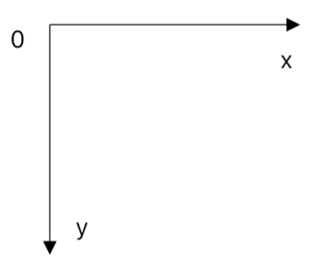
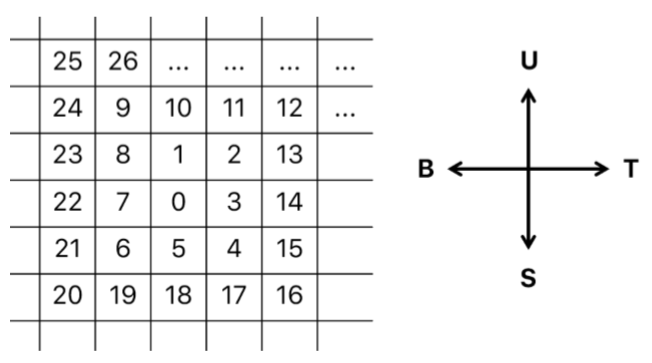
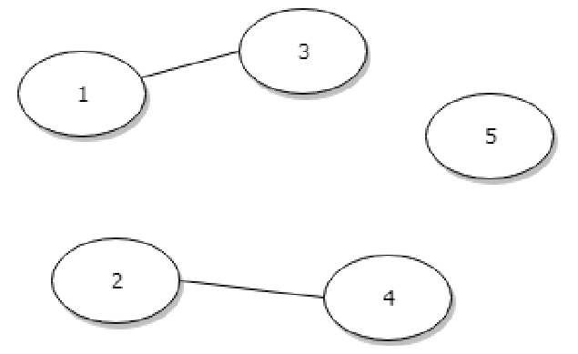
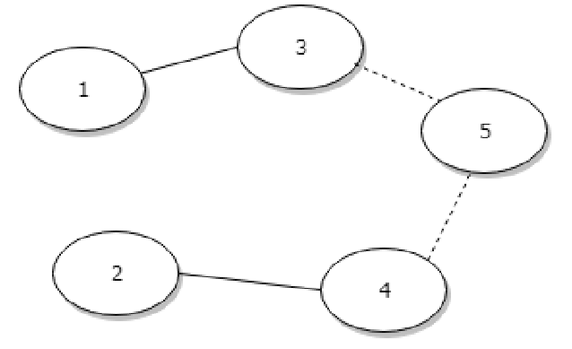

# Soal Praktikum 4 Kelas F
## Daftar Isi 
- [A](#a)
- [B](#b)
- [C](#c)
- [D](#d)
- [E](#e)
- [F](#f)
- [G](#g)

## A 
| Expected Runtime | Memory Limit |
|---|---|
| ≤ 300 ms | 1536 MB |



Abidz is very fond of gardening. This time he wants to build a vertical garden on the fence wall of his house. Abidz has N plants installed in its vertical garden. However, for the watering system, he wants something *out-of-the-box*. 

Let's just say, from the plant pot **P**, Abidz can install a water pipe connecting to the plant pot Q. In its configuration, he wants it in such a way that each pot must get water from the pot above it or parallel to it. Water suply will be done from one of the topmost pots. 

To simplify the problem, Abidz has represented his vertical garden in the cartesian plane (x,y). Each *A<sub>i</sub>* plant is represented as a point that has coordinates (*x<sub>i</sub>*,*y<sub>i</sub>*). The unit in the cartesian plane is meter. If the price of pipe per meter is Rp. M, then what is the minimum total cost that Abidz has to spend? 

#### Input Format 
The input is given in multiple test case. The first line is *T*, the number of test case. For each test case, there are *N* and *M*. For the next *N* lines are *x<sub>i</sub>* and *y<sub>i</sub>*, Abidz plant coordinates. 

#### Output Format 
For each test case, print the cost to be spent in currency format. Cost spent are always rounded up to integer from the actual cost (see the sample output). 

#### Example 
##### Input 
```
2 
2 1250 
5 3 
8 7 
3 1375 
5 3 
8 3 
6 7 
```

###### Output 
```
Rp 6.250 
Rp 9.795 
```

#### Constraints 
* 1 ≤ *N* ≤ 1000 
* 1000 ≤ *M* ≤ 5000 
* 1 ≤ *x<sub>i</sub>* ≤ 1000 
* 1 ≤ *y<sub>i</sub>* ≤ 200 

## B 
| Expected Runtime | Memory Limit |
|---|---|
| ≤ 250 ms | 1536 MB |

Aqielz is the owner of a large building. The building can be used for various activities (multipurpose buildings). The building that Aqielz manages operates 24 hours. Inside the building, there are N rooms which are very big and wide. It is assumed that all types of events can be carried out in any room. 

Today Aqielz receives M room reservation schedules with events and their respective reservation times. One reservation schedule includes information in the form of: 
* The time event starts, 
* The time event ends, and 
* Number of participants in the event. 

The employees need an additional 30 minutes at the end of the event to prepare for the next event plus more time to tidy up the chairs/tables used (1 minute for one chair / table). 

Aqielz wants to held as many events as possible using the minimum amount of room. Find out how many events he can held and how many room is needed. 

#### Input Format 
The first line there are two numbers *N* and *M*. Then, the next *M* lines there are three schedule information according to the description. The start time and end time are written in the format **"HH: MM - HH: MM"** (start time - end time) using the 24-hour format (00:00 - 23:59). Then followed by a number (separated by a space) which states the number of participants in the schedule 

Assume that the number of chairs/tables in the room is infinite and officers only need to tidy up the chairs/tables according to the number of participants. 

#### Output Format 
The output contains two lines. 
* Line 1 prints **"Jumlah kegiatan/acara: "** followed by answers according to the description. 
* Line 2 prints **"Jumlah ruang: "** followed by the answer according to the description. 

#### Example 1 
##### Input 
```
3 3 
06:00 – 08:30 20 
07:00 – 09:00 10 
09:40 – 11:00 5 
```

##### Output 
```
Jumlah kegiatan/acara: 3 
Jumlah ruang: 2 
```

#### Example 2 
##### Input 
```
1 2 
19:00 – 21:00 15 
19:45 – 20:00 100 
```

##### Output 
```
Jumlah kegiatan/acara: 1 
Jumlah ruang: 1 
```

#### Constraints 
* 1 ≤ *N* ≤ 10<sup>5</sup>
* 1 ≤ *M* ≤ 10<sup>4</sup>
* Maximum participants for each events is 100 person. 

## C 
| Expected Runtime | Memory Limit |
|---|---|
| ≤ 30 ms | 1536 MB |

> Easy 

Stefanz is designing an application to control a robot in an arena. The robot is in a grid-shaped area where one cell represents an empty space. Each cell in the grid has a certain number arranged as shown below. 



The robot is placed in a cell numbered *P* and can move to the direction of north, south, west and east. One step of robot movement is one step of movement from one cell to another cell. Stefanz wants to move the robot to the cell with number *Q*, but with the condition: the robot must move cells sequentially (*P*, *P* + 1,*P* + 2,... ,*Q*). Stefanz has made a simple program for the trial. 

#### Input Format 
The first line is a *T* number that represents the number of test cases. The next *T* line there are two numbers *P* and *Q*. 

#### Output Format 
For each test case, print the sequence of instructions that the robot must perform to move from cell *P* to *Q* . The order of instructions is distinguished based on the direction of the robot accompanied by how many steps the robot must take in that direction. 

Each instruction is written in the format "AB" where A is the number of steps and B is the symbol for the cardinal direction. The symbol used is: 
* ‘U’ for the north 
* ‘T’ for the east 
* ‘S’ for the south 
* ‘B’ for the west 

Each instruction is separated by "->" and it should be noted that the last instruction does not need to use the separator. 

#### Example 
##### Input 
```
2 
8 14 
3 5 
```

##### Output 
```
1U -> 3T -> 2S 
1S -> 1B 
```

#### Constraints 
* 0 ≤ *P* < *Q* ≤ 10<sup>7</sup>

## D 
| Expected Runtime | Memory Limit |
|---|---|
| Just get Accepted, that is fine | 1536 MB |

> Very Easy 


After learning about Himawari's potential abilities, Boruto wanted to challenge her. Boruto has *N* (*N* is always odd) integers written in either binary or decimal form. The challenge is that Himawari must sort those integers in ascending order. Then she has to write the result based on the number of binary or decimal forms. 
* If there are more binary forms, the sorting results are written in binary form. 
* However, if there are more decimal forms, then they are written in decimal form. 

Boruto had made a program to verify the results. 

#### Input Format 
The first line is *N*, which is the number of integers. The next *N* lines are integers with the format: 
* character 'b' then followed by a binary form, or 
* character 'd' then followed by a decimal form 

#### Output Format 
*N* lines containing numbers (binary or decimal form) that have been sorted ascending according to the description. 

#### Example 1 
##### Input 
```
3 
b 111 
d 2 
d 15 
```

##### Output 
```
2 
7 
15 
```

#### Example 2 
##### Input 
```
3 
b 111 
b 10 
d 15 
```

##### Output 
```
10 
111 
1111 
```

#### Constraints 
All of the integers are non-negative and in the range of 32-bit integer. 

## E 
| Expected Runtime | Memory Limit |
|---|---|
| ≤ 60 ms | 1536 MB |

There are *N* cities in the TC country. The cities are identified by numbers 0 to *N* − 1. In each city, there is a one-way street that connects the city with other cities. 

Geraldz lives in city 0. Because of business needs, he wants to go to city *N* − 1 with the minimum possible distance. He already knows the minimum distance that must be traveled to get to the city of *N* − 1. Then he thought: "if there was a new road from city *a* to city *b* with a distance of *c* km, could it shorten my trip or not?" 

#### Input Format 
The first line is *N* and *M*. *N* is the number of cities and *M* is the number of roads connecting the two cities. The next line *M* is three numbers *u*, *v*, and *w* which state there is a one-way street from city *u* to city *v* with a distance of *w* km. 

Then the next line is *Q*, which is the number of queries. Each query is defined on one line that contains the numbers *a*, *b*, and *c* according to the description. 

#### Output Format 
For each query, print on one line that contains: 
* If the new road, which is assumed by Geraldz, can shorten the journey, then print "Boleh juga: P km" with P is the new shorter distance. 
* If not, then print "Tidaakkk...". 

#### Example 
##### Input 
```
4 3 
2 3 5 
0 1 1 
1 2 2 
2 
0 2 1 
0 2 4 
```

##### Output 
```
Boleh juga: 6 km 
Tidaakkk... 
```

#### Constraints 
* 2 < *N*,*M* ≤ 20000 
* 1 ≤ *w*,*c* ≤ 1000000 
* 0 ≤ *u*,*v*,*a*,*b* < *N* 
* 1 ≤ *Q* ≤ 50000 

## F 
| Expected Runtime | Memory Limit |
|---|---|
| Just get Accepted, that is fine | 1536 MB |


After becoming one of five Yonkou, Luffy has a dream. He wants to connect all the Island that he ever visit to be connected with a bridge. But not all the island unconnected to other island, there’s few of them that connected to other islands. We will give you *N*, the number of island that Luffy had visited and list of connection between them. The island will be numbered from 1 to *N*. Then please help Luffy to connect all of this island! 

#### Input Format 
The first line contains integer *N* and *P*, number of island and number of connection between them. *P* line afterwards contain integer *A* and *B*, two island that connected. 

#### Output Format 
An integer that represent the number of bridge that Luffy must make to connect all the island. 

#### Example 
##### Input 
```
5 2 
1 3 
2 4 
```

##### Output 
```
2 
```

#### Explanation 


From the sample input, we can conclude that there is 5 islands and island 1 and 3 connected and island 2 and 4 connected. 



Then we can build 2 bridge to connect all the islands like this. 

#### Constraints 
All of the number that used in this problem are placed int the integer range 

## G 
| Expected Runtime | Memory Limit |
|---|---|
| Just get Accepted, that is fine | 1536 MB |


MudMud is in love. His girlfriend loves riddle, then she gives him a riddle. 
```
‘ boom boom boom, let’z cuont 
‘ stat with nothing -- 
‘ enn with something <3 
‘ if youuu, thenn mee won’b mour then one 
‘ if wee arr wee, wii arr wann, nott wiiwii 
```

If he can’t break the riddle, he will break up 

Please help MudMud 

#### Input Format 
n 

#### Output Format 
Count til n 

“AilafyuU” 

#### Example 1 
##### Input 
```
3 
```

##### Output 
```
0 1 2 3 
AilafyuU 
```

#### Example 2 
##### Input 
```
15 
```

#### Output 
```
0 1 2 3 4 5 6 7 8 9 10 12 
AilafyuU 
```

#### Constraints 
As much as MudMud’s loves ~ **∞** 
