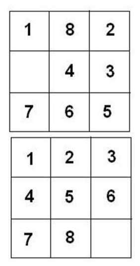

# Soal Praktikum 4 Kelas G
## Daftar Isi
- [Lebaran](#lebaran)
- [Puzzle 8](#puzzle-8)
- [Sendal Favorite Geyzki : The Sequel](#sendal-favorite-geyzki--the-sequel)

## Lebaran
Bulan puasa telah tiba dan Egi tidak sabar untuk menyambut idul fitri. Egi sudah merencanakan untuk berkunjung ke rumah setiap saudaranya. Namun Egi memiliki kendala yaitu dia tidak mempunyai banyak uang dan itu membuat rumah yang bisa dikunjunginya terbatas. Oleh karena itu , Egi ingin mengadakan acara keluarga pada salah satu rumah saudaranya daripada mengunjungi satu persatu rumah setiap saudara.

Terdapat N rumah saudara, dimana semua rumah setidaknya mempunyai jalan untuk kerumah lain, dimisalkan saja rumah-rumah tersebut diberi angka 1 sd N. Untuk pergi ke rumah 1 ke rmh lain terdapat jarak J Km, dimana setiap km nya membutuhkan 1 Liter bensin, sedangkan 1 Liter bensin harganya Rp. 10.000.

Agar tidak menghabiskan uang saudara saudaranya, Egi ingin membuat sedemikian rupa total pengeluaran semua saudaranya untuk acara keluarga seminimal mungkin. Karna Egi mengalami kesulitan, maka bantulah Egi menyelesaikan permasalahan tersebut.

#### Input Format
Baris pertama berupa bilangan T yaitu banyaknya testcase. Untuk setiap testcase, baris pertama berupa N yaitu banyak rumah saudara dan S berupanya banyak jalan yang ada. Pada S baris berikutnya, masukkan 2 rumah dan J yaitu jarak antara kedua rumah tersebut.

#### Constraints
* 1 ≤ T ≤ 10
* 2 ≤ N ≤ 1000
* N-1 ≤ S ≤ 1000
* 1 ≤ J ≤ 1000

#### Output Format
Untuk setiap testcase, output berupa pengeluaran total dari semua saudaranya untuk acara keluarga yang paling minimum dengan format “Kasus #X: …”

#### Sample Input 0
```
1 
5 5 
1 2 3 
2 3 4 
3 5 5 
1 4 1 
2 5 2
```

#### Sample Output 0
```
Kasus #1: 100000
```

#### Explanation 0
Jalur agar pengeluaran paling minimum adalah 1-4, 2-5 ,1-2, 2-3. 3-5 tidak termasuk karena 5 sudah terhubung melalui 2 dan jarak 2-5 lebih pendek dari 3-5. Sehingga pengeluaran total menjadi (3+4+1+2)*10.000 = Rp.100.000

## Puzzle 8
TimTim merupakan seorang anak yang menyukai game puzzle, dia dapat menghabiskan sepanjang waktunya hanya untuk bermain puzzle. Saat ini ia sedang bermain 8 angka puzzle (liat contoh untuk lebih jelasnya) yang dimana terdapat 3 buah baris dan 3 buah kolom, dan terdapat angka 1 sampai 8 dan 1 tempat kosong, dimana setiap langkahnya hanya dapat dilakukan dengan melakukan penggeseran 1 angka ke tempat yang kosong.
Tujuan akhir dari puzzle ini simpel, yaitu dengan menyusun puzzle tersebut menjadi urutan 1 sampai 8 dan diikuti dengan sebuah tempat kosong, untuk contoh liat lah gambar sebagai berikut.



Gambar kiri merupakan posisi awal, sedangkan gambar kanan merupakan tujuang akhir yang akan dicapai. Tugas anda saat ini sangatlah simpel, bantulah TimTim dalam menyelesaikan puzzle denga diberikan posisi awal, apabila puzzle tersebut dapat diselesaikan, keluarkan langkah minimum untuk menyelesaikan puzzle tersebut dan langkah langkah pemindahan yang dilakukan sampai mencapai posisi akhir. Untuk menyelesaikan puzzle tersebut TimTim memiliki urutan prioritas dalam puzzle, yaitu:
1. Pindahkan piece yang berada di atas dari tempat kosong
2. Pindahkan piece yang berada di bawah dari tempat kosong
3. Pindahkan piece yang berada di kanan dari tempat kosong
4. Pindahkan piece yang berada di kiri dari tempat kosong

Gunakan prioritas yang sama untuk menyelesaikan puzzle tersebut

#### Input Format
Terdapat beberapa test case, dimana setiap case terdiri dari 3 baris dimana setiap barisnya terdapat 3 angka berisi bilangan antara 0-8 dimana 0 merupakan angka yang menggambarkan posisi dari tempat kosong.
Input sampai EOF (end of file)

#### Constraints
\-

#### Output Format
Untuk setiap case, keluarkan "Langkah minimum = x" dimana x merupakan langkah minimum dari posisi awal ke posisi akhir puzzle dan diikuti dengan langkah langkah pemindahan dan setiap 2 langkah pemindahan dipisahkan oleh sebuah baris kosong apabila puzzle dapat diselesaikan (liat contoh untuk lebih jelasnya), apabila puzzle tidak dapat diselesaikan, maka keluarkan "Problem tidak dapat diselesaikan"

#### Sample Input 0
```
123 
456 
078 
 
012 
345 
687
```

#### Sample Output 0
```
Langkah minimum = 2 
123 
456 
708 
 
123 
456 
780 
Problem tidak dapat diselesaikan
```

## Sendal Favorite Geyzki : The Sequel
Sering marah karena sendal favoritenya selalu diambil orang lain, geyzki berhasil mendapatkan skill baru, Foresight! 

Sekarang Geyzki bisa melihat ke masa depan siapa saja yang akan mengambil sandal di rak sandal, karena itu geyzki akan mengambil sendalnya. 

Kapanpun akan ada orang yang mengambil sendalnya. Sendal masih tersusun dalam bentuk tumpukan. Jika ada yang datang mengambil sendal tapi sudah tidak ada sendal lagi, mereka akan datang lagi setelah orang terakhir di antrian mengambil sandal. Ibaratnya antri ulang. 

Tumpukan sendal sekarang memiliki nama sendiri, dan sendal favorite geyzki adalah "Choco Banana" Ketika geyzki mengambil sendalnya, dia akan menyimpan sendalnya sampai akan ada yang menaruh sendal lagi dan sendal dia tidak menjadi paling atas. 

Tambahan hint, untuk mengambil nama, bisa cek [getline](http://www.cplusplus.com/reference/string/string/getline/) dan [ws](http://www.cplusplus.com/reference/istream/ws/) dan [thread](https://stackoverflow.com/questions/26111698/c-discard-the-leftover-newline-from-input-buffer-issue) ini, cek juga [map](http://www.cplusplus.com/reference/map/map/map/)

#### Input Format
baris pertama berupa N N baris berikutnya adalah nama orang yang datang mengambil sendal, nama pasti berupa dua kata yang dipisahkan spasi baris berikutnya adalah X X baris berikutnya adalah nama sendal di tumpukan sebelum ada yang datang mengambil, urut dari bawah ke atas, ketentuan nama sama seperti sebelumnya

#### Constraints
* 0 <= N <= X N+1 <= X <= 10^9

#### Output Format
Setiap akan ada yang mengambil sendal geyzki, print Geyzki mengambil sendalnya sebelum datang!

#### Sample Input 0
```
4 
Imam Rafii 
Imam Rafii 
Geizka Wahyu 
Test Person 
5 
Purple Elytra 
Black Void 
Red Crimson 
Blue Marine 
Choco Banana
```

#### Sample Output 0
```
Geyzki mengambil sendalnya sebelum Imam Rafii datang! 
Geyzki mengambil sendalnya sebelum Test Person datang!
```
