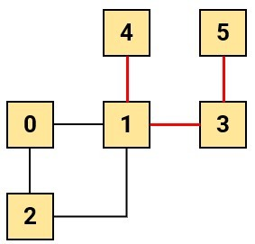
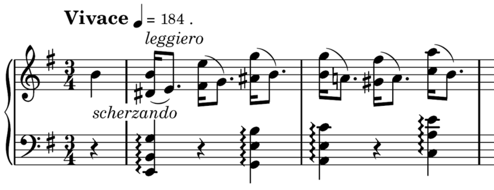
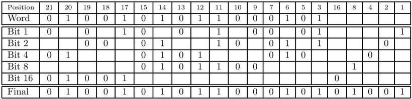
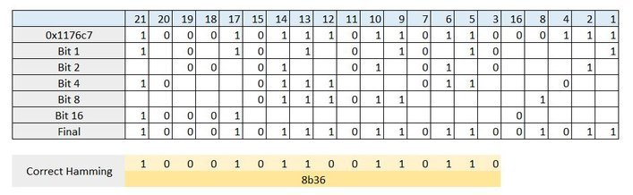
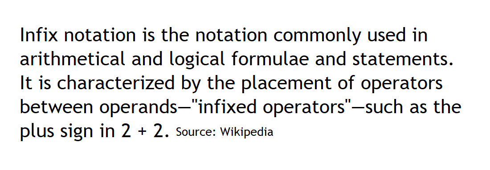
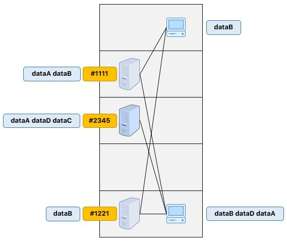
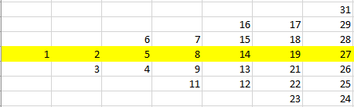
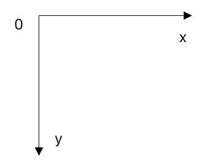

# Soal Praktikum Final
## Daftar Isi
- [Altitudo Finita Quaerere 0.8](#altitudo-finita-quaerere-0.8)
- [Bagi Dua](#bagi-dua)
- [Budak Cinta (Easy)](#budak-cinta-(easy))
- [Budak Cinta (Hard)](#budak-cinta-(hard))
- [Crusial Pipe](#crusial-pipe)
- [Cumulative Time Battle 2.0](#cumulative-time-battle-2.0)
- [Easy Hex Tree](#easy-hex-tree)
- [EzUlarTangga](#ezulartangga)
- [Étude Op. 25, No. 5](#Étude-Op.-25,-No.-5)
- [Game of Two Stacks](#game=of=two=stacks)
- [Gubernur Baru](#gubernur-baru)
- [Hitung Lagi!](#hitung-lagi!)
- [How Many Islands?](#how-many-islands)
- [Infix Notation](#infix-notation)
- [Koyer Final](#koyer-final)
- [Local Area Network](#local-area-network)
- [Permutasi](#permutasi)
- [Pohon](#pohon)
- [SDITSAVL - AVL Tree](#sditsavl---avl-tree)
- [Sepatu Penunjuk Arah](#sepatu-penunjuk-arah)
- [Simple Git](#simple-git)
- [Tempat Parkir Nadiz](#tempat-parkir-nadiz)
- [Train of Thought](#train-of-thought)
- [Vertical Garden](#vertical-garden)

## Altitudo Finita Quaerere 0.8
Centcent Batubrata membangun sebuah weighted directed graph. Ia meminta bantuan kalian untuk menghitung jarak dari satu vertex ke semua vertex dalam graph tersebut. Untuk membuat pencarian ini menarik, Centcent memikirkan ide berikut.

* Pertama-tama, jarak dari vertex X ke semua vertex di deklarasikan INFINITY.
* Dari vertex X, ditelusuri salah satu tetangganya lalu tetangga dari tetangga tersebut kemudian tetangga dari tetangganya lagi sampai mencapai jalan buntu atau mengenai batas L.
* Ketika mengenai batas L atau bertemu jalan buntu, terapkan langkah kedua pada tetangga dari parent dari vertex terakhir yang ditelusuri.
* Nilai dari jarak vertex X ke vertex lain akan selalu diupdate menjadi nilai yang lebih kecil berdasarkan hasil penelusuran.
* Bila penelusuran bertemu ke sebuah vertex yang sudah dikunjungi, ia akan diproses apabila jarak yang dimilikinya lebih pendek dari rute lain tersebut.

#### Input Format
Pada baris pertama, masukkan V.

Pada baris kedua, masukkan E.

Untuk E baris berikutnya, isi Vi, Vj, dan W. (Membuat Edge dari Vi ke Vj dengan berat W)

Pada baris terakhir, masukkan X dan L.

#### Sample Input 1
```
8
15
0 2 29
0 5 7
0 6 6
1 0 21
2 1 20
3 1 24
3 4 5
3 6 28
3 7 20
4 0 3
4 5 12
6 1 20
7 1 17
7 4 15
7 6 10
0 1
```

#### Sample Input 2
```
8
15
0 2 29
0 5 7
0 6 6
1 0 21
2 1 20
3 1 24
3 4 5
3 6 28
3 7 20
4 0 3
4 5 12
6 1 20
7 1 17
7 4 15
7 6 10
0 2
```

#### Constraints
* 1 < V <= 64
* 1 < E <= V * (V-1)
* X = [0..V-1]
* L = [1..V]

#### Output Format
Output berupa daftar vertex diikuti jarak X ke vertex tersebut. Jika tidak ditemukan jalan atau tidak terdeteksi dalam batas kedalaman L, keluarkan "INFINITY".

#### Sample Output 1
```
0 0
1 INFINITY
2 29
3 INFINITY
4 INFINITY
5 7
6 6
7 INFINITY
```

#### Sample Output 2
```
0 0
1 26
2 29
3 INFINITY
4 INFINITY
5 7
6 6
7 INFINITY
```

## Bagi Dua
Setiap diakhir semester akan ada banyak final project yang harus dikerjakan oleh Dio. Biasanya final project akan dikerjakan secara berkelompok, satu kelompok berdua. Saat ingin membagi tugas Dio kebingungan. Sebagai temannya bantulah dio dengan membuatkan program yang dapat membagi tugas dengan bobot yang adil untuk dua orang.

(1 Tugas tidak dapat dipecah untuk dibagi 2)

#### Input Format
Baris pertama berisi T - banyak tugas yang akan dikerjakan. Untuk T baris berikutnya berisi Bi - bobot dari tiap tugas.

#### Constraints
* 1 <= T <= 100
* 1 <= Bi <= 100000

#### Output Format
Dua buah bilangan (Bobot tiap pembagian) yang merupakan hasil pembagian tugas-tugas.

#### Contoh Input
```
5
12
13
11
20
15
```

#### Contoh Output
```
36 35
```

## Budak Cinta (Easy)
Eyou dan Ilov adalah sepasang kekasih yang terpisah oleh jarak. Mereka berdua tinggal di kota yang berbeda. Tetapi mereka masih tetap berada di satu negara yaitu Enpisiesia. Di dalam Enpisiesia terdapat N buah kota yang dihubungkan oleh M buah jalan dua arah. Kota-kota tersebut dinomori dari 1 sampai N. Dijamin pasti ada cara untuk pergi dari satu kota ke kota lainnya menggunakan satu atau lebih ruas jalan.

Enpisiesia terbagi dalam beberapa provinsi yang berbeda. Dua buah kota U dan V berada di dalam provinsi yang sama jika dan hanya jika terdapat lebih dari 1 cara untuk pergi dari U ke V ataupun sebaliknya.

Negara Enpisiesia terkenal dengan teknologinya yang sangat maju. Salah satu teknologi kebanggaan bangsa Enpisinesia adalah “Teleporter”. Teleporter ini terdapat  di semua kota di Enpisinesia. Dengan teleporter ini,seseorang dapat berpindahan dari satu kota ke kota lainnya dalam waktu sekejap. Tetapi,seseorang hanya dapat memakai teleporter untuk berpindah ke kota yang berada di dalam provinsi yang sama.           

Selanjutnya,anda diharuskan menjawab Q buah pertanyaan. Untuk setiap pertanyaan ke-i,anda diharuskan mencari total panjang jalan terpendek yang harus dilalui Eyou untuk sampai ke rumah Ilov jika keduanya masing-masing tinggal di kota Xi dan Yi

#### Input Format
Baris pertama terdiri dari 2 buah bilangan N dan M. Banyaknya kota serta jalan pada negara Enpisinesia

M baris selanjutnya terdiri dari 3 buah bilangan Ai,Bi dan Wi. Yang berarti bahwa terdapat jalan yang menghubungkan kota Ai dan Bi sepanjang Wi.

Baris selanjutnya terdiri dari 1 buah bilangan Q,yang melambangkan banyaknya query.

Q baris selanjutnya berisi 2 buah bilangan Xi dan Yi seperti yang telah dijelaskan di deskrpisi soal.

#### Constraints
* 2 ≤ N ≤ 1000
* M = N – 1
* 1 ≤ Wi ≤ 109
* 1 ≤ Q ≤ 10^5

#### Output Format
Q baris berisi sebuah bilangan yang merupakan jawaban dari masing-masing pertanyaan.

### Sample Input 0
```
8 7
1 2 3
1 3 4
2 7 1
2 8 3
3 4 5
3 5 2
3 6 3
3
1 5
4 6
7 6
```

#### Sample Output 0
```
6
8
11
```

#### Explanation 0
Untuk query pertama, urutan perjalanan Ilov adalah

* Dari Kota 1 ke Kota 3 menggunakan transporter
* Dari Kota 3 ke Kota 10 menggunakan jalan biasa.
* Total jalan yang dilewati Ilov adalah 0 + 6 = 6.

Untuk query kedua,Ilov dapat langsung menggunakan jalan biasa yang menghubungkan kota 2 dan 4

Untuk query ketiga,Ilov dapat pergi ke kota 5 menggunakan transporter lalu kembali menggunakan transporter untuk ke kota 7. Dengan begitu ia tidak perlu menggunakan jalan biasa sama sekali.

## Budak Cinta (Hard)
> Perbedaan versi easy dan hard hanyalah di batasannya

Deskripsi dapat dilihat [di sini](#budak-cinta-(easy))

#### Input Format
Baris pertama terdiri dari 2 buah bilangan N dan M. Banyaknya kota serta jalan pada negara Enpisinesia

M baris selanjutnya terdiri dari 3 buah bilangan Ai,Bi dan Wi. Yang berarti bahwa terdapat jalan yang menghubungkan kota Ai dan Bi sepanjang Wi.

Baris selanjutnya terdiri dari 1 buah bilangan Q,yang melambangkan banyaknya query.

Q baris selanjutnya berisi 2 buah bilangan Xi dan Yi seperti yang telah dijelaskan di deskrpisi soal.

#### Constraints
* 2 ≤ N ≤ 1000
* N - 1 ≤ M ≤ 2500
* 1 ≤ Wi ≤ 10^9
* 1 ≤ Q ≤ 1000

#### Output Format
Q baris berisi sebuah bilangan yang merupakan jawaban dari masing-masing pertanyaan.

#### Sample Input 0
```
10 11
1 2 7
2 4 3
4 5 2
4 6 2
6 7 3
5 7 4
1 3 5
2 3 4
3 10 6
8 9 1
5 8 3
3
1 10
2 4
4 7
```

#### Sample Output 0
```
6
3
0
```

#### Explanation 0
Untuk query pertama, urutan perjalanan Ilov adalah

* Dari Kota 1 ke Kota 3 menggunakan transporter
* Dari Kota 3 ke Kota 10 menggunakan jalan biasa.
* Total jalan yang dilewati Ilov adalah 0 + 6 = 6.

Untuk query kedua,Ilov dapat langsung menggunakan jalan biasa yang menghubungkan kota 2 dan 4

Untuk query ketiga,Ilov dapat pergi ke kota 5 menggunakan transporter lalu kembali menggunakan transporter untuk ke kota 7. Dengan begitu ia tidak perlu menggunakan jalan biasa sama sekali.

## Crusial Pipe
There are *N* (*N* always even) water pools numbered *0* to *N-1*. Also, there are pipes connecting the pools. The pipes are built in such a way that water can be distributed to all pools even though only one is given water. A pipe is considered "crucial" if it broken will cause the water cannot be distributed to all pools.



Each pool has a maintenance cost of *s<sub>i</sub>*. Knowing that there is no budget for pipes maintenance, you want to divide the cost list into two item-equal lists (has *N/2* costs):
* One list for pools maintenance, and
* One list for pipes maintenance

You want a number *X* that is the difference between the total sum of each list can be as minimum as possible. Not only that, the information about crusial pipe is also important. Hence, find out which pipes are considered "crucial".

#### Input Format
The first line of input is *N*, the number of pools. The second line are *N* number *s<sub>i</sub>* separated by space. The third line is *M*, the number of pipes. Next *M* lines are information about the pipes which has two number *u* and *v* meaning that there is a pipe connecting pools *u* and *v*.

#### Constraints
* 2 ≤ *N* ≤ 500
* 1 ≤ *s<sub>i</sub>* ≤ 100
* 1 ≤ *M* ≤ *N(N-1)/2*
* 0 ≤ *u,v* ≤ *N* - 1

#### Output Format
Print two numbers *X* and *Y*, which is the minimum difference between the two cost lists and the number of crucial pipes.

Case 1, if there are crusial pipes, then the next *Y* lines are two pairs of numbers *a* and *b* (two pools connected by the pipe), with criteria:
* It starts with the string **"Pipa #x: "**, followed by the * numbers *a* and *b*, *x* starting at 1.
* Number *a* < *b*.
* Sorted ascending based on priority *a* then *b*.

Case 2, no crusial pipes or *Y* = 0, print **"Aman"** in the next line.

#### Sample Input 0
```
6
1 1 2 2 66 4
6
0 2
0 1
2 1
1 3
1 4
3 5
```

#### Sample Output 0
```
60 3
Pipa #1: 1 3
Pipa #2: 1 4
Pipa #3: 3 5
```

## Cumulative Time Battle 2.0
"One Final Game"

Terdapat beberapa entitas game yang dibedakan menjadi PLAYER dan ENEMY. Mereka akan melawan satu sama lain sampai salah satu kubuh kalah. Tiap entitas memiliki HP, ATK, DEF, MAG, dan SPD.

Mereka juga memiliki sebuah bar ACTION yang menentukan giliran mereka menyerang. Bar ini mula-mula berisi [0..30], lalu diisi dengan SPD entitas. Ketika bar mencapai 100, akan terjadi action sebagai berikut:
* 70% Menyerang dengan senjata (ATK - DEF) * 2 atau MAG (jika ATK < DEF).
* 25% Menyerang dengan ultimate magic (MAG * 9).
* 5% Cast Haste (SPD * 2 sampai action berikutnya).

Random variance dari physical damage adalah [90..110]% dan magic damage [70..130]%. Physical damage memiliki 30% chance untuk critical (damage * 3).

Fungsi random akan selalu dipanggil ketika menginisiasi bar ACTION, menghitung action yang akan digunakan, menghitung random variance, dan critical. Fungsi random dapat diambil pada intip.in/SDNoradier

#### Fungsi Random
```c++
int randVal;
int randOffset;
int modular;

void initRand(){
	randVal = 0;
	randOffset = 3651;
	modular = 31627;
}

int nextVal(){
	randVal += randOffset;
	randVal *= randOffset;
	randVal %= modular;
	
	return randVal;
}
```

#### Template Character
```c++
void printCharacter(int id){
	if(id == -1){
		printf("Tidak ada pemenang\n");
		return;
	}
	switch(id){
		case 1: printf("Elpis\n");
				break;
		case 2: printf("Leonard\n");
				break;
		case 3: printf("Haza\n");
				break;
		case 4: printf("Pupuro\n");
				break;
		case 5: printf("Horus\n");
				break;
		case 6: printf("Xiwangmu\n");
				break;
		case 7: printf("Nuwa\n");
				break;
		case 8: printf("Yog\n");
				break;
		case 9: printf("Giemsa\n");
				break;
		case 10: printf("Reimu\n");
				break;
		case 11: printf("Cang Bi\n");
				break;
		case 12: printf("Radha\n");
				break;
		case 13: printf("Aurora\n");
				break;
		case 14: printf("Astrid\n");
				break;
		case 15: printf("Ralph\n");
				break;
		case 16: printf("Shamash\n");
				break;
		case 17: printf("Enlil\n");
				break;
		case 18: printf("Marduk\n");
				break;
		case 19: printf("Veronica\n");
				break;
		case 20: printf("Marisa\n");
				break;
		case 21: printf("Spencer\n");
				break;
		case 22: printf("Diamond\n");
				break;
		case 23: printf("Amber\n");
				break;
		case 24: printf("Jade\n");
				break;
		case 25: printf("Sapphire\n");
				break;
		case 26: printf("Ruby\n");
				break;
		case 27: printf("Lyndis\n");
				break;
		case 28: printf("Florina\n");
				break;
		case 29: printf("Fiora\n");
				break;
		case 30: printf("Sakuya\n");
				break;
		case 31: printf("Farina\n");
				break;
		case 32: printf("Nino\n");
				break;
		case 33: printf("Renault\n");
				break;
		case 34: printf("Eirika\n");
				break;
		case 35: printf("Vanessa\n");
				break;
		case 36: printf("Tana\n");
				break;
		case 37: printf("Syrene\n");
				break;
		case 38: printf("Amelia\n");
				break;
		case 39: printf("Joshua\n");
				break;
		case 40: printf("Alice\n");
				break;
		case 41: printf("Hansekyo\n");
				break;
		case 42: printf("Dwuaykicong\n");
				break;
		case 43: printf("NETral\n");
				break;
		case 44: printf("iNSANiTY\n");
				break;
		case 45: printf("Vinseks\n");
				break;
		case 46: printf("Aiedail\n");
				break;
		case 47: printf("Heisser\n");
				break;
		case 48: printf("MAXiMUSE\n");
				break;
		case 49: printf("p03tato\n");
				break;
		case 50: printf("Youmu\n");
				break;
		case 51: printf("Ikta\n");
				break;
		case 52: printf("Franz\n");
				break;
		case 53: printf("Zephiel\n");
				break;
		case 54: printf("Idunn\n");
				break;
		case 55: printf("Shanna\n");
				break;
		case 56: printf("thea\n");
				break;
		case 57: printf("Juno\n");
				break;
		case 58: printf("Yaisyeky\n");
				break;
		case 59: printf("Gerik\n");
				break;
		case 60: printf("Mayumi\n");
				break;
		case 61: printf("Cecilia\n");
				break;
		case 62: printf("Sophia\n");
				break;
		case 63: printf("Douglas\n");
				break;
		case 64: printf("Duessel\n");
				break;
	}
}
```

SEMUA ENTITAS MENYERANG TARGET DENGAN SPD TERENDAH.

#### Input Format
Pada baris pertama, masukkan P dan E.

Untuk P + E baris berikutnya, masukkan HP, ATK, DEF, MAG, dan SPD. Urutan input berupa P baris dulu baru E baris.

#### Sample Input 1
```
4 1
4200 240 220 290 24
4500 240 220 145 30
3300 300 210 300 26
9600 270 290 140 25
9900 380 90 420 42
```

#### Sample Input 2
```
4 3
4200 240 220 290 24
4500 240 220 145 30
3300 300 210 300 26
9600 270 290 140 25
4400 380 190 420 21
4400 380 190 420 21
9900 720 390 550 35
```

#### Constraints
* 1 <= P, E <= 8
* 1 <= HP <= 99999
* 1 <= ATK, DEF, MAG <= 999
* 1 <= SPD <= 99

#### Output Format
Output berupa log pertarungan. Daftar log berupa berikut:
1. Action
* 70%: "Player/Enemy id menyerang menggunakan senjatanya! Menghasilkan %d damage ke Enemy/Player id!" atau "Player/Enemy id menyerang menggunakan Magic! Menghasilkan %d damage ke Enemy/Player id!" jika (ATK < DEF).
* 25%: "Player/Enemy id menyerang menggunakan Ultimate Magic! Menghasilkan %d damage ke Enemy/Player id!"
* 5%: "Player/Enemy id cast Haste!"
2. Jika Player Mati
* "Player id tumbang..."
3. Jika Enemy mati
* "Enemy id telah dikalahkan!"
Di akhir pertarungan, keluarkan hasil berupa "You Won!" atau "Game Over." diakhiri dengan newline.

#### Sample Output 1
```
Player 2 menyerang menggunakan Ultimate Magic! Menghasilkan 1062 damage ke Enemy 1!
Enemy 1 menyerang menggunakan Ultimate Magic! Menghasilkan 2835 damage ke Player 1!
Player 1 menyerang menggunakan senjatanya! Menghasilkan 495 damage ke Enemy 1!
Player 4 menyerang menggunakan senjatanya! Menghasilkan 582 damage ke Enemy 1!
Player 3 cast Haste!
Enemy 1 menyerang menggunakan Ultimate Magic! Menghasilkan 3438 damage ke Player 1!
Player 1 tumbang...
Player 3 menyerang menggunakan senjatanya! Menghasilkan 678 damage ke Enemy 1!
Enemy 1 menyerang menggunakan senjatanya! Menghasilkan 99 damage ke Player 4!
Player 2 menyerang menggunakan senjatanya! Menghasilkan 154 damage ke Enemy 1!
Player 4 menyerang menggunakan Ultimate Magic! Menghasilkan 981 damage ke Enemy 1!
Player 2 menyerang menggunakan senjatanya! Menghasilkan 432 damage ke Enemy 1!
Player 3 menyerang menggunakan Ultimate Magic! Menghasilkan 2052 damage ke Enemy 1!
Enemy 1 menyerang menggunakan Ultimate Magic! Menghasilkan 2718 damage ke Player 4!
Player 4 menyerang menggunakan senjatanya! Menghasilkan 172 damage ke Enemy 1!
Enemy 1 menyerang menggunakan Ultimate Magic! Menghasilkan 3627 damage ke Player 4!
Player 2 cast Haste!
Player 3 menyerang menggunakan senjatanya! Menghasilkan 621 damage ke Enemy 1!
Enemy 1 menyerang menggunakan senjatanya! Menghasilkan 267 damage ke Player 4!
Player 2 menyerang menggunakan Ultimate Magic! Menghasilkan 1458 damage ke Enemy 1!
Player 4 menyerang menggunakan senjatanya! Menghasilkan 167 damage ke Enemy 1!
Player 3 menyerang menggunakan Ultimate Magic! Menghasilkan 2025 damage ke Enemy 1!
Enemy 1 telah dikalahkan!
You Won!
```

#### Sample Output 2
```
Player 2 menyerang menggunakan Ultimate Magic! Menghasilkan 972 damage ke Enemy 1!
Enemy 3 menyerang menggunakan senjatanya! Menghasilkan 1650 damage ke Player 1!
Enemy 2 menyerang menggunakan senjatanya! Menghasilkan 516 damage ke Player 1!
Player 1 menyerang menggunakan senjatanya! Menghasilkan 162 damage ke Enemy 1!
Player 4 cast Haste!
Player 3 menyerang menggunakan Ultimate Magic! Menghasilkan 2457 damage ke Enemy 1!
Enemy 1 menyerang menggunakan senjatanya! Menghasilkan 164 damage ke Player 1!
Player 4 menyerang menggunakan senjatanya! Menghasilkan 88 damage ke Enemy 1!
Enemy 3 menyerang menggunakan Ultimate Magic! Menghasilkan 3861 damage ke Player 1!
Player 1 tumbang...
Player 2 menyerang menggunakan Ultimate Magic! Menghasilkan 990 damage ke Enemy 1!
Enemy 1 telah dikalahkan!
Player 3 menyerang menggunakan senjatanya! Menghasilkan 315 damage ke Enemy 2!
Enemy 2 menyerang menggunakan Ultimate Magic! Menghasilkan 2718 damage ke Player 4!
Enemy 3 menyerang menggunakan senjatanya! Menghasilkan 412 damage ke Player 4!
Player 2 menyerang menggunakan senjatanya! Menghasilkan 147 damage ke Enemy 2!
Player 4 menyerang menggunakan Ultimate Magic! Menghasilkan 1206 damage ke Enemy 2!
Enemy 3 cast Haste!
Player 3 menyerang menggunakan senjatanya! Menghasilkan 324 damage ke Enemy 2!
Player 2 menyerang menggunakan Ultimate Magic! Menghasilkan 1458 damage ke Enemy 2!
Enemy 3 menyerang menggunakan senjatanya! Menghasilkan 399 damage ke Player 4!
Player 4 menyerang menggunakan Ultimate Magic! Menghasilkan 945 damage ke Enemy 2!
Enemy 2 menyerang menggunakan senjatanya! Menghasilkan 90 damage ke Player 4!
Player 3 menyerang menggunakan Ultimate Magic! Menghasilkan 2403 damage ke Enemy 2!
Enemy 2 telah dikalahkan!
Enemy 3 menyerang menggunakan senjatanya! Menghasilkan 460 damage ke Player 4!
Player 2 menyerang menggunakan Magic! Menghasilkan 155 damage ke Enemy 3!
Player 4 menyerang menggunakan Magic! Menghasilkan 114 damage ke Enemy 3!
Enemy 3 menyerang menggunakan Ultimate Magic! Menghasilkan 6138 damage ke Player 4!
Player 4 tumbang...
Player 3 menyerang menggunakan Magic! Menghasilkan 285 damage ke Enemy 3!
Player 2 menyerang menggunakan Magic! Menghasilkan 117 damage ke Enemy 3!
Enemy 3 menyerang menggunakan senjatanya! Menghasilkan 530 damage ke Player 3!
Player 2 cast Haste!
Player 3 menyerang menggunakan Magic! Menghasilkan 351 damage ke Enemy 3!
Enemy 3 menyerang menggunakan senjatanya! Menghasilkan 474 damage ke Player 3!
Player 2 menyerang menggunakan Magic! Menghasilkan 137 damage ke Enemy 3!
Player 3 menyerang menggunakan Magic! Menghasilkan 213 damage ke Enemy 3!
Enemy 3 menyerang menggunakan Ultimate Magic! Menghasilkan 6237 damage ke Player 3!
Player 3 tumbang...
Player 2 menyerang menggunakan Magic! Menghasilkan 153 damage ke Enemy 3!
Enemy 3 menyerang menggunakan senjatanya! Menghasilkan 495 damage ke Player 2!
Player 2 cast Haste!
Enemy 3 menyerang menggunakan Ultimate Magic! Menghasilkan 5589 damage ke Player 2!
Player 2 tumbang...
Game Over.
```

## Easy Hex Tree
Create a binary search tree with input hex number, and print the pre order transversal of the tree with:
* If you found alphabet in the node print “ALP, x” with x as the value of the nodenla
* At the end of the preorder transversal print the sum value of the node with alphabet hex value in decimal

#### Input Format
Lines of hex number (N) that ended with -1

#### Constraints
* -1 <= N <= INT_MAX

#### Output Format
Preorder transversal of the tree with:
* If you found alphabet in the node print “ALP x” with x as the value of the node
* At the end of the preorder transversal print the sum value of the node with alphabet hex value in decimal

#### Sample Input 0
```
2
1
4
-1
```

#### Sample Output 0
```
0x2
0x1
-0x1
ALP, 0x2a
sum of number with alphabet = 42
```

## EzUlarTangga
Ular Tannga adalah sebuah permainan board game berupa persegi dimana dalam persegi itu dibagi menjadi kotak-kotak kecil yang memiliki angka yang berurutan dan pada beberapa kotak-kotak kecil itu terdapat "ular" dan "tangga". Pada umumnya pemain menetukan langkahnya dengan menggunakan dadu bermata 6. Namun tidak seperti pada permainan ular tangga pada umumnya, pada EzUlarTangga pemain tidak perlu gacha untuk mendapatkan mata dadu yang diinginkan. Pemain mempunyai cheat agar mata dadu yang keluar sesuai dengan keinginannya. Namun sebagai gantinya pada tiap permainan posisi ular dan tangga sering kali berubah. Mulai dari sini permainan berubah dari game gacha menjadi game logika matematika.

Saat mengetahui permainan ini Rani,seorang mahasiswa tc langsung berpikir bagaimana cara dia bisa terus memenangkan game ular tangga ini. Rani memiliki pikiran untuk membuat program yang menghitung berapa kali pelemparan dadu minimum yang dibutuhkan mencapai finish. Bantulah Rani membuat progrmanya!

#### Input Format
Baris pertama adalah integer N yaitu jumlah kota kecil pada ular tangga.

Baris kedua adalah integer t yaitu jumlah testcase atau permainan.

Untuk setiap testcase berisi integer c yaitu jumlah ular dan tangga pada papan itu.

c baris berikutnya berisi integer a dan b yang menunjukan sebuah ular atau tangga dari posisi a menuju posisi b. (a dan b dimulai dari 0,berarti a=1 b=5 berarti dari petak 2 ke petak 6).

#### Constraints
* 10 <= N <= 2*10^4
* 0 < t <= 10^5
* 0 < c <= 2*10^3
* 0 <= a,b < N-1

#### Output Format
Untuk tiap testcase cetak jawaban.

#### Sample Input 0
```
17
1
2
10 5
4 13
```

#### Sample Output 0
```
2
```

#### Explanation 0
Board dengan ukuran 17 akan membentuk 17 kotak kecil dari angka 1-17.

Pada testcase pertama salah satu pengambilan dadu dengan pelemparan minimum adalah dengan melempar dadu 4 dari petak 1 menuju petak 5 kemudian naik menuju petak 14, kemudian melempar dadu 3 menuju ke petak 17.

## Étude Op. 25, No. 5
Étude Op. 25, No. 5 merupakan sebuah karya oleh Frédéric Chopin pada tahun 1837. Karya ini juga memiliki nama yaitu "Wrong Note". Nama ini diberikan dari bagian pembukanya yang dimainkan dengan cepat seolah-olah terdapat kesalahan note saat memainkannya dan dengan cepat memperbaikinya.



Keadaan "Wrong Note" tersebut hampir juga dirasakan oleh Baney dimana saat ini ia sedang ditugaskan untuk menulis sebuah bilangan dengan cepat, namun agar Baney terhindar dari kasus "Wrong Bit" maka Baney akan meng-encodenya dengan kode Hamming. Pada kode hamming, misal ketika Baney memiliki bilangan hexadecimal "4ac5", maka bila representasikan dengan kode hamming yang benar akan menjadi "958a9" sebagai berikut.



Bantulah Baney untuk mengecek apabila ada kesalahan dalam penulisannya bila kode hamming yang dibuat Baney memiliki bit seperti pada tabel diatas dengan 5 bit paritas genap.

#### Input Format
Baris pertama berisi sebuah bilangan n yang menunjukkan banyaknya kasus uji. Untuk tiap kasus uji berisi sebuah bilangan m dalam hexadecimal dengan maksimal total kesalahan pada sebuah bit.

#### Constraints
* 0x0 ≤ *m* ≤ 0x7fffffff
* 1 ≤ *n* ≤ 10<sup>6</sup>

#### Output Format
Untuk setiap kasus uji, keluarkan bilangan yang telah dikoreksi dalam bentuk hexadecimal tanpa paritasnya.

#### Sample Input 0
```
2
958a9
1176c7
```

#### Sample Output 0
```
4ac5
8b36
```

#### Explanation 0
Untuk kasus 1176c7, visualisasinya sebagai berikut.



## Game of Two Stacks
Alexa has two stacks of non-negative integers, stack *A = [a<sub>0</sub>, a<sub>1</sub>, ..., a<sub>n-1</sub>]* and stack *B = [b<sub>0</sub>, b<sub>1</sub>, ..., b<sub>m-1</sub>]* where index *0* denotes the top of the stack. Alexa challenges Nick to play the following game:
* In each move, Nick can remove one integer from the top of either stack *A* or stack *B*.
* Nick keeps a running sum of the integers he removes from the two stacks.
* Nick is disqualified from the game if, at any point, his running sum becomes greater than some integer  given at the beginning of the game.
* Nick's *final score* is the total number of integers he has removed from the two stacks.

Given *A*, *B*, and *x* for *g* games, find the maximum possible score Nick can achieve (i.e., the maximum number of integers he can remove without being disqualified) during each game and print it on a new line.

#### Input Format
The first line contains an integer, *g* (the number of games). The *3 . g* subsequent lines describe each game in the following format:
1. The first line contains three space-separated integers describing the respective values of *n* (the number of integers in stack *A*), *m* (the number of integers in stack *B*), and  (the number that the sum of the integers removed from the two stacks cannot exceed).
The second line contains  space-separated integers describing the respective values of *a<sub>0</sub>, a<sub>1</sub>, ..., a<sub>n-1</sub>*.
The third line contains  space-separated integers describing the respective values of *b<sub>0</sub>, b<sub>1</sub>, ..., b<sub>m-1</sub>*.

#### Constraints
* 1 ≤ *g* ≤ 50
* 1 ≤ *n,m* ≤ 10<sup>5</sup>
* 0 ≤ *a<sub>i</sub>, b<sub>j</sub>* ≤ 10<sup>6</sup>
* 1 ≤ *x* ≤ 10<sup>9</sup>

#### Subtasks
* 1 ≤ *n,m* ≤ 100 for *50%* of the maximum score.

#### Output Format
For each of the *g* games, print an integer on a new line denoting the maximum possible score Nick can achieve without being disqualified.

#### Sample Input 0
```
1
5 4 10
4 2 4 6 1
2 1 8 5
```

#### Sample Output 0
```
4
```

#### Explanation 0
The two stacks initially look like this:


The image below depicts the integers Nick should choose to remove from the stacks. We print  as our answer, because that is the maximum number of integers that can be removed from the two stacks without the sum exceeding .


(There can be multiple ways to remove the integers from the stack, the image shows just one of them.)

## Gubernur Baru
Provinsi nepisi adalah salah satu provinsi yang terletak di Negara Schetamics. Provinsi ini terdiri dari *N* buah kota yang dihubungkan oleh *M* buah ruas jalan 2 arah. Setiap kota di provinsi ini dapat dikunjungi dari kota lain menggunakan 1 atau lebih ruas jalan.

Ardi baru-baru ini terpilih menjadi gubernur provinsi nepisi. Sebagai program kerja pertamanya, ia ingin menampung aspirasi dari rakyat-rakyatnya mengenai kondisi jalanan di provinsi nepisi ini. Maka dari itu pertama-tama dia ingin menghitung berapa jumlah total jarak terpendek Antara dua kota untuk setiap pasang kota di provinsi itu.

Dengan kata lain, Ardi ingin mengetahui berapa total *Dist(i,j)* untuk setiap pasang *(i,j) 1 ≤ i ≤ j ≤ N* dimana *Dist(i,j)* berarti jarak terpendek yang dapat ditempuh dari i ke j

#### Input Format
Baris pertama berisi 2 buah bilangan *N* dan *M* yang merupakan banyaknya kota serta ruas jalan di provinsi nepisi.

*M* baris selanjutnya berisi 2 buah bilangan *U* dan *V* dan *W* yang berarti ada ruas jalan yang menghubungkan kota *U* dan *V* sepanjang *W*.

#### Constraints
0 ≤ *M* < *N* ≤ 10<sup>5</sup>
1 ≤ *W* ≤ 1000

#### Output Format
Total jarak terpendek untuk setiap pasang kota dalam modulo 1000000007.

#### Sample Input 0
```
3 2
1 2 5
1 3 3
```

#### Sample Output 0
```
16
```

#### Explanation 0
*Dist(1,2)* = 5

*Dist(1,3)* = 3

*Dist(2,3)* = 8

Total = 16

## Hitung Lagi!
Tugas Anda sederhana dalam masalah ini: hitung jumlah Minimum Spanning Tree (MST) dalam graf sederhana yang tidak berarah. Jumlah Minimum Spanning Tree (MST) berarti dalam berapa banyak cara Anda dapat memilih subset dari edge suatu graf yang membentuk Minimum Spanning Tree (MST).

#### Input
Baris pertama berisi dua bilangan bulat N, M. Node dilabeli dari 1 hingga N. Pada baris M berikut, setiap baris berisi tiga bilangan bulat ai, bi, ci, mewakili edge yang tidak berarah dari node ai ke node bi, dengan bobot ci. Anda dapat mengasumsikan paling banyak satu edge antara dua node, dan graf yang dijelaskan oleh input terhubung.

#### Output
Cetak bilangan % 31011

#### Input Format
```
4 6
1 2 1
1 3 1
1 4 1
2 3 2
2 4 1
3 4 1
```

#### Constraints
* (1 ≤ N ≤ 100)
* (1 ≤ M ≤ 1000)
* (1 ≤ ai ≠ bi ≤ N, 1 ≤ ci ≤ 1.000.000.000)

#### Output Format
```
8
```

## How Many Islands?
Given a 2 dimensional map of 1s(island) and 0s(water). Determine the number of island in that map. An island is covered by water on all of it adjacent sides. You can assume that all of the four edges of the map is surrounded by water as well.

#### Input Format
s

#### Constraints
size max: 10x10

#### Output Format
s

#### Sample Input 0
```
1 1 0
1 0 1
0 0 1
```

#### Sample Output 0
```
2
```

#### Sample Input 1
```
1 0 1
0 1 0
1 0 1
```

#### Sample Output 1
```
5
```

## Infix Notation
This problem contains a riddle. There are 3 integers hidden. You have to build 4 integers *A*, *B*, *C*, and *D* from those hidden integers. The clues are:
* Two of the integers are prime
* Sum of the prime numbers yields *A*
* Non-prime number is *B*
* *C* is obtained from *A + B*
* *D* is obtained from *B + C*

Now let's go to the problem. Read the explanation provided from this image (important, you will need this).



Given an infix expression composed from *A*, *B*, *C*, and *D*. The operators used are common arithmetic operator {+, -, \*, (, )}. Evaluate the expression to get the result, let's say *X*. Then you have to join all digit of *X* (sequentially) exactly *N* times. For example *N = 3* and *X = 345*, the result after joining is 345345345.

The task is to find *Y* mod *3331* where *Y* is the joined integer. Simple and so easy ^_^, right?

#### Input Format
First line of input is *T*, the test case. Each test case contains two lines:
* Number *N*, and
* The infix expression

It is guaranteed that the result *Y* always positive.

#### Constraints
*N* will never larger than 100.

#### Output Format
For each test case, output a single line containing a number: the result of *Y* mod *3331*.

#### Sample Input 0
```
2
5
A + B + C
6
A + B + (C + A)
```

#### Sample Output 0
```
2916
883
```

## Koyer Final
Koyer dan teman teman sedang bermain sambung kata, dengan mengurutkan kata dari yang terkecil ke terbesar. yuk main bareng dengan koyer dan bantulah dia untuk mengurutkan kata tersebut

#### Input Format
Baris pertama adalah bilangan bulat n sebagai testcase Baris n berikutnya adalah q yang berisi banyak kata

#### Constraints
* 0 < n < 100 
* 0 < q < 1000

#### Output Format
menampilkan kata yang terurut, jika terdapat kata yang sama maka hanya satu kata saja yang muncul

#### Sample Input 0
```
1
aku sayang sama kamu tapi kamu sayang sama dia
```

#### Sample Output 0
```
aku dia kamu sama sayang tapi
```

#### Sample Input 1
```
3
HURUF BESAR berbeda dengan huruf kecil
angka delapan juga beda dengan 8 ya
kata gapake koma sama kata, pake komaa juga beda ya
```

#### Sample Output 1
```
BESAR HURUF berbeda dengan huruf kecil
8 angka beda delapan dengan juga ya
beda gapake juga kata kata, koma komaa pake sama ya
```

#### Explanation 1
beda ya

## Local Area Network
Membangun *Local Area Network* merupakan salah satu solusi ketika hendak membangun jaringan berskala lokal di area seperti gedung, perkantoran, sekolah dsb. Kali ini, sebuah kantor perusahaan mempunyai komputer server sebanyak *N* buah yang tiap komputernya diwakili oleh sebuah id berupa string. Data-data perusahaan disimpan didalam komputer server, namun tidak semua server mempunyai data yang sama.



Terdapat *M* buah komputer client yang beroperasi setiap harinya. Komputer-komputer client tersebut membutuhkan data dari komputer server, namun tidak semua client membutuhkan data yang sama. Ketika komputer client membutuhkan data tertentu, maka komputer tersebut akan **membuat koneksi kepada semua server yang mempunyai data yang dibutuhkan**.

Komputer server maupun komputer client tersebar di lantai yang berbeda-beda. Kamu hendak melakukan analisis terhadap keandalan transfer data pada jaringan tersebut. Kamu ingin mengetahui berapa total koneksi yang dibuat oleh *M* komputer client kepada server dan urutan data yang datang ke masing-masing client. Data akan lebih cepat terkirim apabila jarak antar dua komputer (jarak antar lantai) semakin dekat.

#### Input Format
Pertama terdapat *N* yakni banyaknya komputer server. Baris selanjutnya adalah deskripsi masing-masing server. Setiap server dideskripsikan pada dua baris yang berisi:
1. [id_server] [banyaknya data disimpan] [nomor lantai server berada]
2. [nama data 1] [nama data 2] .... [nama data terakhir]

Kemudian baris selanjutnya adalah deskripsi komputer client. Pertama adalah *M* yakni banyaknya komputer client. Masing-masing komputer client (client ke-*i*, dimulai dari 1) dideskripsikan pada dua baris yaitu:

1. [banyaknya kebutuhan data] [nomor lantai client berada]
2. [nama data 1] [nama data 2] .... [nama data terakhir]

#### Constraints
* 1 ≤ *N,M* ≤ 1000
* id server terdiri dari karakter `#` and `0`-`9`
* nama data terdiri dari huruf alfabet
* 1 ≤ banyak data yang disimpan/dibutuhkan ≤ 100

#### Output Format
Untuk setiap client, cetak diawali oleh string **“Client i: ”**. Kemudian baris-baris selanjutnya berisi urutan data yang datang pada client tersebut. Jika terdapat lebih dari satu data yang datang bersamaan, maka cetak sesuai urutan lexicographic. Setelah semua client selesai dicetak, baris paling terakhir adalah string **“Total koneksi: “** diikuti oleh banyaknya koneksi yang dibuat oleh semua client.

#### Sample Input 0
```
3
#1221 2 4
dataA dataB
#2345 3 3
dataA dataD dataC
#1111 1 1
dataB
2
3 1
dataB dataD dataA
1 5
dataB
```

#### Sample Output 0
```
Client 1:
dataB
dataA
dataD
Client 2:
dataB
Total Koneksi: 5
```

## Permutasi
Diberikan suatu permutasi yang terdiri dari *N* buah bilangan. Tentukan urutan leksikografi dari permutasi tersebut.

Urutan leksikografi dari suatu permutasi *P* adalah jumlah permutasi berbeda yang lebih kecil atau sama dengan *P* secara leksikografi

Sebuah permutasi *P<sub>1</sub>,P<sub>2</sub>,P<sub>3</sub>*,…,*P<sub>N</sub>* dikatakan lebih kecil dari permutasi *Q<sub>1</sub>,Q<sub>2</sub>,Q<sub>3</sub>*,…,*Q<sub>N</sub>* jika dan hanya jika terdapat suatu bilangan *K* dimana *P<sub>K</sub> < Q<sub>K</sub>* dan *P<sub>i</sub> = K<sub>i</sub>* untuk 1 ≤ *i* < *K*

#### Input Format
Baris pertama berisi sebuah bilangan *N* yang menyatakan banyaknya bilangan

Baris selanjutnya berisi *N* buah bilangan berbeda *P<sub>1</sub>,P<sub>2</sub>*,…,*P<sub>N</sub>* dimana *P<sub>i</sub>* adalah bilangan dengan urutan ke-i pada permutasi

#### Constraints
* 1 ≤ N ≤ 10<sup>5</sup>
* 1 ≤ P<sub>i</sub> ≤ 10<sup>9</sup>

#### Output Format
Sebuah baris berisi sebuah bilangan yang merupakan urutan leksikografi dari *P* dalam modulo *1000000007*.

#### Sample Input 0
```
3
28 1 15
```

#### Sample Output 0
```
5
```

#### Explanation 0
Terdapat 6 kemungkinan permutasi berbeda dengan urutan:

1. 1 15 28
2. 1 28 15
3. 15 1 28
4. 15 28 1
5. 28 1 15
6. 28 15 1

P berada di urutan ke 5.

## Pohon
Diberikan sebuah *rooted tree* yang terdiri dari *N* node dengan node 1 sebagai root dari tree tersebut. Di setiap node terdapat salah satu karakter dari ‘a’ sampai ‘z’.

Diberikan *Q* buah query yang terdiri dari 2 tipe :
1. Tipe pertama meng-*update* karakter-karakter yang berada pada *subtree* u menjadi 1 karakter setelahnya. Asumsikan karakter-karakter tersebut bersifat sirkular yang artinya setelah di*update* karakter ‘z’ akan menjadi karakter ‘a’
2. Tipe kedua,diberikan sebuah string,tentukan apakah kita dapat membentuk string tersebut menggunakan karakter-karakter yang berada pada *subtree* node u.

Tetapi untuk versi ini tidak terdapat query tipe 1.

#### Input Format
Baris pertama berisi 2 buah bilangan *N* dan *Q*. Banyaknya node dan banyaknya query

Baris berikutnya berisi *N - 1* bilangan *A<sub>i</sub>* dimana *A<sub>i</sub>* berarti parent dari node *i* + 1 pada tree.

Baris berikutnya berisi *N* buah karakter *B<sub>i</sub>* dimana *B<sub>i</sub>* merupakan karakter yang ada pada node *i*

*Q* baris berikutnya berisi query-query dengan format:
1. “1 u” untuk query tipe pertama. Dengan u merupakan root dari subtree yang akan di*update*
2. “2 u s” untuk query tipe kedua. Dengan u merupakan root dari subtree serta s adalah string yang akan dibentuk

#### Constraints
* 1 ≤ N,Q ≤ 10<sup>5</sup>
* 1 ≤ *A<sub>i</sub>* ≤ N
* *B<sub>i</sub>* hanya terdiri dari karakter ‘a’ – ‘z’
* |*s*| ≤ N
* 1 ≤ *u* ≤ N
* Total |s| tidak lebih dari 5*10<sup>5</sup>

#### Output Format
Untuk setiap query tipe 2,keluarkan “YA” jika bisa membentuk string yang diberikan dan “TIDAK” jika tidak.

#### Sample Input 0
```
12 3
1 1 1 2 2 2 3 8 8 6 6
a a k b c i c m a u n t
2 1 aku
2 2 cinta
2 1 kamu
```

#### Sample Output 0
```
YA
YA
YA
```

#### Explanation 0
A subtree of a tree T is a tree consisting of a node in T and all of its descendants in T.Nodes thus correspond to subtrees (each node corresponds to the subtree of itself and all its descendants) – the subtree corresponding to the root node is the entire tree, and each node is the root node of the subtree it determines; the subtree corresponding to any other node is called a proper subtree (wikipedia)

Artiin sendiri ya. ehe

## SDITSAVL - AVL Tree
This problem is an extension problem (with a little modification) from this problem: http://www.spoj.com/problems/SDITSBST/

In this problem you are given two type of query
1. Insert an integer to the list.
2. Given an integer x, you're about to find an integer k which represent x's index if the list is sorted in ascending order. Note that in this problem we will use 1-based indexing.

As the problem title suggest, this problem intended to be solved using Balanced Binary Search Tree, one of its example is AVL Tree.

#### Input
The first line contains an integer Q, which denotes how many queries that follows.
The next Q lines will be one of the type queries which follow this format:
* 1 x means insert x to the list
* 2 x means find x's index if the list is sorted in ascending order.

#### Output
For each query type 2, print a line containing an integer as the answer or print "Data tidak ada" no quotes if the requested number does not exist in the current lis.

#### Input Format
```
10
1 100
1 74
2 100
2 70
1 152
1 21
1 33
2 100
2 21
2 1
```

#### Constraints
* 1 ≤ Q ≤ 200000
* 1 ≤ x ≤ 10^6
* It is guaranteed that all integer that inserted in the list will be distinct.

#### Output Format
```
2
Data tidak ada
4
1
Data tidak ada
```

## Sepatu Penunjuk Arah
Awal bulan depan brand sepatu "Penunjuk Arah" akan merilis sepatu baru, seperti rilisan sepatu-sepatu sebelumnya pasti akan banyak orang yang akan menyerbu dan antre untuk mendapatkan sepatu hype ini.

Karena anda kenal dengan orang dalam, anda mendapatkan beberapa bocoran yaitu pengunjungnya antri dengan pattern seperti ular. Setiap pengunjung yang ingin membeli sudah diberi nomor sebelumnya sesuai dengan urutan datang si pengunjung tersebut dari 1 sampai N. Hanya ada sebanyak 1 orang yang dapat masuk ke dalam toko dan orang itu hanya orang yang berada di tengah. Pemilik sepatu "Penunjuk Arah" akan memanggil antrian orang di tengah secara acak, karena pemilik tidak menyukai nomor kelipatan 10 ia menghapus semua angka yang habis dibagi 10.

Karena anda merupakan programmer handal, anda akan membuat program untuk memprediksi nomor-nomor yang akan dipanggil.

#### Input Format
Urutan ke N dari orang yang dipanggil

#### Constraints
* 1 ≤ N ≤ 10^9

#### Output Format
Nomor orang yang dipanggil

#### Sample Input 0
```
6
```

#### Sample Output 0
```
19
```

#### Explanation 0


## Simple Git
Kalian tahu apa itu Git? Git adalah salah satu jenis pengontrol versi yang berguna bagi programmer yang ingin mengembangkan program secara bersama-sama. Disini kalian akan membuat program Git sederhana.

Program ini akan menyimpan data berupa commit yang terdiri dari ID (berupa integer) dan nama commit (berupa string). Commit yang dapat bisa dipanggil sewaktu-waktu dengan perintah "log". Program juga bisa berpindah antar commit terpilih dengan perintah "checkout". Perintah lain dapat dilihat di bagian Input Format.

Selain itu, program dapat berpindah antar branch. Branch adalah kumpulan commit yang terpisah. Selain berpindah, program juga akan dapat melakukan sinkronisasi branch, yaitu dengan membuat branch lain menyamai kita, dengan menghilangkan commit branch lain. Untuk menyederhanakan program, hanya ada 2 branch disini yaitu "master" dan "feature". Secara default, program akan berjalan di branch master.

Selamat mengerjakan :3

#### Input Format
Program akan terus berjalan hingga ada input "quit". Perintah yang disediakan terdiri dari :

* commit
Akan diberikan nama commit berupa string. Simpan nama commit dan ID. ID dimulai dari 0 dan akan terus bertambah setiap commit yang dimasukkan.

* reset
Akan diberikan ID commit yang ingin di-reset. Hapus semua commit dari yang terbaru sampai pada ID yang diberikan. ID tidak perlu direset. Lalu pindahkan commit tempat Anda berada ke commit dengan ID yang diberikan.

Setelah itu, keluarkan string "Anda berada di commit **Nama Commit**" (tanpa tanda kutip)

* log
Untuk seluruh commit, keluarkan ID commit dan nama commit secara berurutan, dipisahkan dengan newline. Bila tidak ada commit yang tersimpan, cukup keluarkan newline.

* checkout
Diberikan ID commit, pindahkan commit Anda ke commit dengan ID yang diberikan, dan keluarkan string "Anda berada di commit **Nama Commit**" (tanpa tanda kutip). Bila ID commit tidak ditemukan, keluarkan string "ID tidak ditemukan" (tanpa tanda kutip).

* status
Keluarkan commit tempat Anda sekarang, format outputnya adalah "Anda berada di commit **Nama Commit**" (tanpa tanda kutip)

* branch
Akan diberikan input berupa "master" atau "feature". Pindahkan branch tempat Anda berada ke branch yang diberikan.

* sync
Untuk perintah sync; pertama cari ID terbesar dimana ID di branch tempat Anda berada sekarang dan branch satunya lagi memiliki nama yang sama, lalu hapus seluruh commit di branch satunya sampai ID terbesar tadi. **Branch tempat Anda berada tidak perlu diubah.**

Sebagai contoh ilustrasi penjelas :

**Sebelum sync** (Posisi sekarang di branch **master**)

Branch master : *r1 － r2 － r3*

Branch feature : *r1 － r2 － r3* － r4 － d4 － d5

**Setelah sync**

Branch master : r1 － r2 － r3

Branch feature : r1 － r2 － r3

* quit
Hentikan program.

#### Constraints
String untuk nama commit dijamin kurang dari 100 karakter, dan jumlah commit (per branch) dijamin kurang dari 1000.

#### Output Format
Keluarkan string sesuai perintah.

#### Sample Input 0
```
commit Test_1
commit Test_2
commit Test_3
log
checkout 1
checkout 99
reset 1
commit rinrin
log
quit
```

#### Sample Output 0
```
2
Test_3
1
Test_2
0
Test_1
Anda berada di commit Test_2
ID tidak ditemukan
Anda berada di commit Test_2
3
rinrin
1
Test_2
0
Test_1
```

#### Explanation 0
* Saat ada commit (line 1 - 3), masukkan commit.
* Saat ada perintah log (line 4), keluarkan log.
* Saat ada perintah checkout (line 5), karena commit dengan ID 1 ada, maka pindah ke ID 1 dan keluarkan pesan.
* Saat ada perintah checkout (line 6), karena commit dengan ID 99 tidak ada, keluarkan pesan ID tidak ditemukan.
* Saat ada perintah reset (line 7), hapus seluruh commit sampai dengan ID 1 (ID 1 tidak termasuk)
* Saat ada perintah commit (line 8), lakukan commit dengan melanjutkan ID yang dibuat sebelumnya.
* Saat ada perintah quit, hentikan program.

#### Sample Input 1
```
commit r1    
commit r2   
commit r3     
commit r4 
commit d1
commit d2
commit d3
branch feature
commit r1    
commit r2   
commit r3
commit r4 
commit d4
commit d5
branch master
sync
log
branch feature
log
quit
```

#### Sample Output 1
```
6
d3
5
d2
4
d1
3
r4
2
r3
1
r2
0
r1
3
r4
2
r3
1
r2
0
r1
```

#### Explanation 1
Di line 8, ada perintah branch feature. Maka pindahkan branch dari master (default) ke feature.

Di line 16, ada perintah sync saat kita berada di branch master. Maka hapus seluruh commit di branch feature sampai branch feature sama dengan awalan di branch master. Perhatikan 4 log terakhir branch master setelah sync di line 7-14 dan log branch feature di line 15-22.

Untuk lebih jelasnya, bisa dilihat ilustrasi berikut :

**Sebelum sync** (Posisi sekarang di branch **master**)

Branch master : *r1 － r2 － r3 － r4* － d1 － d2 － d3

Branch feature : *r1 － r2 － r3 － r4* － d4 － d5

**Setelah sync**

Branch master : *r1 － r2 － r3 － r4* － d1 － d2 － d3

Branch feature : *r1 － r2 － r3 － r4*

## Tempat Parkir Nadiz
Di Zaman modern ini dimana jumlah kepadatan penduduk cukup tinggi sehingga membuat harga tanah tinggi. Hal ini pun membuat sebagian orang lebih memilih menggunakan jasa tempat parkir daripada membuat garasi.

Dengan melihat adanya peluang ini Nadiz pun membeli sebidang tanah dan akan membuatnya menjadi tempat parkir. Namun karena lahan yang tersedia terbatas, Nadiz hanya bisa mendapatkan tanah yang cukup kecil. Tempat parkir yang dibangun pun hanya mempunyai 1 koridor yang mana lebarnya hanya cukup untuk 1 mobil saja. Dengan begitu mobil parkir pertama pun akan menempati ujung tempat parkir dan ketika mau keluar dan ada mobil kedua dan seterusnya, maka mobil pertama tidak bisa keluar. Apabila mobil parkir pertama keluar dia harus menunggu mobil-mobil setelahnya keluar terlebih dahulu.

Apabila berhasil print "Lancar Jaya" kalau tidak "Gak Bisa Woi"

#### Input Format
Akan ada beberapa testcase. Tiap testcase dimulai dengan 2 bilangan bulat N dan K. Dimana N adalah jumlah dari mobil yang akan masuk dan K adalah kapasitas lahan parkir.

N baris berikutnya berupa 2 bilangan bulat A dan E. Dimana A adalah waktu kedatangan dan E adalah waktu pergi.

Tempat parkir ini tidak memungkinkan untuk lebih dari 1 mobil datang bersamaan ataupun pergi secara bersamaan. Namun memungkinkan untuk datang dan pergi pada waktu yang bersamaan.

Apabila N = K = 0, maka akan mengakhiri program.

#### Constraints
* 3 ≤ N ≤ 100
* 1 ≤ K ≤ 1000
* 1 ≤ Ai, Ei ≤ 1000
* Ai < Ai+1 untuk tiap 1 ≤ i < N

#### Output Format
Lancar Jaya

Gak Bisa Woi

#### Sample Input 0
```
5 3
1 10
2 3
3 9
4 7
7 8
2 1
1 5
3 8
0 0
```

#### Sample Output 0
```
Lancar Jaya
Gak Bisa Woi
```

## Train of Thought
Ini soal susah loh, yakin?

Oh seriusan?

Kalau pengen kerjain sih gapapa...

Tapi ini beneran susah loh :')

Aku gak yakin kamu menahan emosi karena susahnya soal ini...

Okedeh kalau maksa...

Tapi inget, ini soal susah!

Jangan lupa berdoa ya! Karena soalnya susah! :D

Semangat, jangan tanya alasan soal ini bisa susah yah!

Ya, karena memang susah.

Nomer kursi kereta Pak John Petrucci gak ada yang sama,tapi bingung gimana cara ngeceknya.

#### Input Format
Baris pertama berisi N buah bilangan. Baris kedua berisi N buah bilangan X sebagai nomer kursi.

#### Constraints
* 1 ≤ N,X ≤ 100000000

#### Output Format
Jika ada yang sama, cetak "SUSAH BANGED WOI!".

Jika tidak ada yang sama, cetak "NAH GITU DONG, NGEGAS!"

#### Sample Input 0
```
1
1
```

#### Sample Output 0
```
NAH GITU DONG, NGEGAS!
```

## Vertical Garden
Aksa sangat suka bercocok tanam. Kali ini ia ingin membangun taman vertikal di dinding pagar rumahnya. Aksa memiliki N tanaman yang dipasang di taman vertikal. Namun, untuk sistem penyiraman, dia menginginkan sesuatu yang tidak biasa.

Katakan saja, dari pot tanaman *P*, Aksa dapat memasang pipa air yang menghubungkan ke pot tanaman *Q*. Dalam konfigurasinya, ia menginginkannya sedemikian rupa sehingga setiap pot harus mendapatkan air dari pot di atasnya atau sejajar dengannya. Suplai air akan dilakukan dari salah satu pot paling atas.



Untuk menyederhanakan masalah, Aksa telah menggambarkan taman vertikal pada bidang kartesius (*x*, *y*). Setiap tanaman *A<sub>i</sub>* direpresentasikan sebagai titik yang memiliki koordinat (*x<sub>i</sub>*, *y<sub>i</sub>*). Satuan dalam bidang kartesius adalah meter. Jika harga pipa per meter adalah Rp. *M*, lalu berapa total biaya minimum yang harus dikeluarkan Aksa?

#### Input Format
Masukan diberikan dalam beberapa kasus uji. Baris pertama adalah *T*, jumlah kasus uji. Untuk setiap kasus uji, ada *N* dan *M*. Untuk  baris berikutnya adalah *X<sub>i</sub>* dan *y<sub>i</sub>*, koordinat tanaman Aksa.

#### Constraints
* 1 ≤ *N* ≤ 5000,
* 1000 ≤ *M* ≤ 5000,
* 1 ≤ *x<sub>i</sub>* ≤ 1000,
* 1 ≤ *y<sub>i</sub>* ≤ 200

#### Output Format
Untuk setiap kasus uji, cetak biaya yang akan dikeluarkan dalam format mata uang. Biaya yang dikeluarkan selalu dibulatkan ke atas menjadi bilangan bulat dari biaya aktual (lihat contoh output).

#### Sample Input 0
```
2
2 1250
5 3
8 7
3 1375
5 3
8 3
6 7
```

#### Sample Output 0
````
Rp 6.250
Rp 9.795
````

#### Explanation 0
Tidak ada penjelasan
